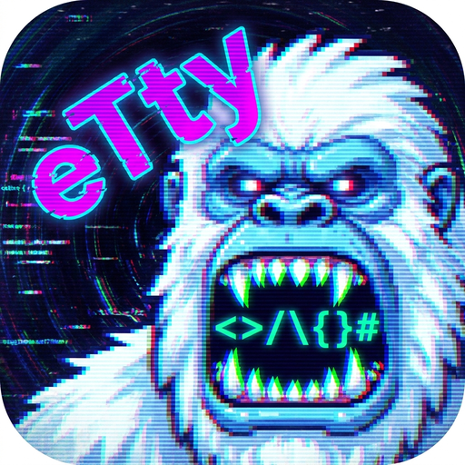

# eTty

Modern terminal emulator built with Electron. Lightweight, fast, and feature-rich.

<p align="center">
  
</p>

## Features

### Terminal

- **Multiple tabs** with independent zsh sessions
- **WebGL-accelerated** rendering (canvas fallback)
- **Kitty keyboard protocol** — Shift+Enter, Ctrl+Enter, Ctrl+Shift+Enter sequences
- **Full Unicode support** — Cyrillic, accented characters, emoji
- **Shell directory tracking** via OSC 7 — file tree syncs automatically
- **Command busy indicator** via OSC 133 — navigation buttons reflect shell state
- **Tab drag-and-drop** — reorder tabs by dragging the grip handle
- **10,000 lines** scrollback buffer

### Command History

- **Shared global history** (5,000 lines) across all tabs
- **Per-tab history files** — each tab gets its own `HISTFILE`
- **Smart merging** — new commands merge back to global on tab close
- **Session restore** — history survives app restarts
- **Automatic cleanup** of orphaned history files

### File Tree (Sidebar)

- **Lazy-loaded** directory tree with expand/collapse
- **Hidden files** toggle
- **Quick navigation** — `cd ..` and `cd ~` buttons
- **Live sync** — filesystem watcher with 300ms debounce
- **Context menus** — new file/folder, rename, delete, copy, paste, open external, copy relative path
- **Multi-select** — Ctrl/Cmd+Click, Shift+Click range, Ctrl+A select all
- **Drag-and-drop** — move files/folders within the tree
- **Undo** — Ctrl+Z to undo last move operation
- **Resizable** sidebar (150–600px)
- **Path traversal protection** — all paths validated against CWD

### Code Editor

- **CodeMirror 6** with syntax highlighting for 20+ languages:
  JavaScript/TypeScript, Python, Go, Rust, HTML, CSS/SCSS, JSON, YAML, Markdown, Vue, C#
- **Send to terminal** — select code and send it to the active shell (Cmd+Enter)
- **Unsaved changes** indicator
- **Auto-features** — bracket closing, fold gutter, active line highlight, search
- **Resizable** editor panel

### Git Integration

- **Status bar** showing `± +N -N` diff stats, updated every 5 seconds
  - **Click on stats** to toggle Git panel
- **Branch management** — switch, create, delete branches
- **Inline diff viewer** with colored additions/deletions
- **Commit, push, discard** — all from the GUI
- **Per-file stats** — additions and deletions count for each changed file

### AI Agents

- **Status-bar launcher** — one-click launch of detected CLI agents
- **Auto-detection** — Claude, Codex, Copilot, Cursor Agent, OpenCode
- **Busy lock** — agent buttons disabled while terminal is busy
- **Active agent highlight** — launched agent button glows while running
- **Force-disable** — toggle agents on/off in Settings
- **Proxy support** — configure HTTP proxy for all agent commands
- **Customizable quick replies** — define agent-specific quick commands (e.g., `/clear`, `Ok`, `Продолжай`) via Settings; drag-and-drop to reorder

### Settings

- **7 built-in themes:** Catppuccin Mocha (default), Monokai, Dracula, One Dark, Nord, Solarized Dark, Gruvbox Dark
- **Focus indicator** — glow, border, top-line, or none
- **File tree behavior** — collapse children on close, single/double-click to open
- **Prompt style** — default (from `~/.zshrc`), short, minimal, arrow (for new tabs)
- **AI agent quick replies** — CRUD editor with per-agent toggles; drag-and-drop reordering
- **Auto-persisted** to disk with debounced saves

### Session Persistence

- **Tab state** saved on quit, restored on next launch (with confirmation dialog)
- **Per-tab tree state** — expanded directories and scroll position remembered when switching tabs
- **Menu option** to manually restore tabs

## Keyboard Shortcuts

| Shortcut | Action |
|----------|--------|
| `Cmd+E` / `Ctrl+E` | Toggle editor panel |
| `Cmd+S` / `Ctrl+S` | Save file in editor |
| `Cmd+Enter` | Send selection from editor to terminal |
| `Shift+Enter` | Kitty protocol: `\x1b[13;2u` |
| `Ctrl+Enter` | Kitty protocol: `\x1b[13;5u` |
| `Ctrl+Shift+Enter` | Kitty protocol: `\x1b[13;6u` |

## Tech Stack

| Component | Technology |
|-----------|-----------|
| Desktop shell | Electron 33 |
| Build tooling | electron-vite (Vite-based) |
| Terminal UI | xterm.js 5.5 + WebGL, Fit, WebLinks, Search addons |
| PTY backend | node-pty 1.0 (native module) |
| Code editor | CodeMirror 6 with 13 language packages (JS/TS, Python, Go, Rust, HTML, CSS, JSON, YAML, Markdown, Vue, C#) |
| Git operations | simple-git |
| Packaging | electron-builder |
| Logging | electron-log |
| Auto-update | electron-updater (stub) |

## Getting Started

### Prerequisites

- **Node.js 18+**
- **macOS**: Xcode Command Line Tools — `xcode-select --install`

### Development

```bash
npm install
npm run dev
```

### Building

```bash
# 1. Compile with electron-vite
npm run build

# 2. Package distributable
npm run dist          # macOS .dmg (arm64 + x64)
npm run dist:win      # Windows NSIS installer
npm run dist:linux    # Linux AppImage + .deb
```

Output goes to `dist/`.

### Code Signing (macOS)

Without certificates the app is signed ad-hoc — fine for local testing.
For a signed and notarized release:

```bash
export CSC_LINK=/path/to/certificate.p12
export CSC_KEY_PASSWORD=...
export APPLE_ID=you@example.com
export APPLE_APP_SPECIFIC_PASSWORD=xxxx-xxxx-xxxx-xxxx
export APPLE_TEAM_ID=XXXXXXXXXX
npm run build && npm run dist
```

### Verify Signing

```bash
codesign -dv --verbose=4 dist/mac-arm64/eTty.app
spctl -a -vvv -t install dist/mac-arm64/eTty.app
```

## Architecture

```
┌──────────────────────────────────────────────────────────┐
│                       Main Process                       │
│  ┌──────────┐ ┌──────────┐ ┌──────────────────────────┐  │
│  │PtyManager│ │FileManager│ │   HistoryManager        │  │
│  │ node-pty │ │ fs ops   │ │   global + per-tab      │  │
│  └──────────┘ └──────────┘ └──────────────────────────┘  │
│  ┌──────────┐ ┌──────────┐ ┌──────────┐ ┌────────────┐  │
│  │GitService│ │ TabState │ │SettingsStore│ │AgentService│  │
│  │simple-git│ │ persist  │ │ JSON config  │ │ detect CLI │  │
│  └──────────┘ └──────────┘ └──────────────┘ └────────────┘  │
└──────────────────────┬─────────────────────────────────────┘
                       │ IPC (~50 channels)
┌──────────────────────┴─────────────────────────────────────┐
│                  Preload (contextBridge)                   │
│              ~50 methods on window.electronAPI               │
└──────────────────────┴─────────────────────────────────────┘
                       │
┌──────────────────────┴─────────────────────────────────────┐
│                     Renderer Process                         │
│  ┌────────┐ ┌────────┐ ┌──────────┐ ┌──────────┐ ┌──────┐  │
│  │Terminal│ │FileTree│ │EditorPanel│ │ GitPanel │ │Settings│  │
│  │xterm.js│ │ lazy   │ │CodeMirror │ │  diff    │ │ overlay│  │
│  │ tabs   │ │ DnD    │ │ 20+ langs │ │ branches │ │ themes │  │
│  └────────┘ └────────┘ └──────────┘ └──────────┘ └──────┘  │
│  ┌────────┐ ┌─────────────────────────────────────────────┐  │
│  │ TabBar │ │              StatusBar                      │  │
│  │ reorder│ │  git ±  │  cwd  │  node  │  AI agents  │   │  │
│  └────────┘ └─────────────────────────────────────────────┘  │
└────────────────────────────────────────────────────────────┘
```

## Data Storage

All user data is stored in `~/.config/eTty/` (Electron `userData`):

| File | Purpose |
|------|---------|
| `settings.json` | App settings (theme, focus indicator, file tree behavior, prompt style, agent proxy, force-disabled agents, quick replies) |
| `tabs-state.json` | Saved tab state for session restore |
| `history/global.zsh_history` | Shared command history (5000 lines) |
| `history/tabs/<id>.zsh_history` | Per-tab command history |

## Notes

- `node-pty` is a **native module**. electron-builder rebuilds it automatically via `npmRebuild: true`.
- `build/entitlements.mac.plist` contains macOS entitlements required for node-pty under hardened runtime (JIT, unsigned memory, library validation).
- Auto-update is **stubbed** — logs only, no update server configured yet.
- Settings overlay blocks tab switching to prevent focus leaking to hidden terminals.

## License

Private
