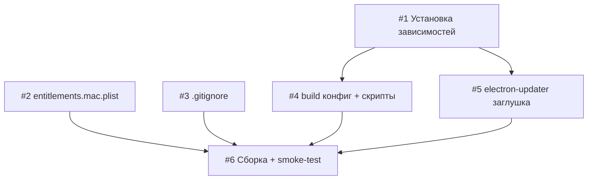

# План реализации: App Packaging

## Обзор

Настройка electron-builder для сборки подписанного macOS .dmg. Конфиг включает секции Windows/Linux и заглушку electron-updater для будущего авто-обновления.

## Задачи

### Блок 1 — Подготовка (параллельно)

| # | Задача | Файлы | Зависит от | Режим выполнения | Проверка |
|---|--------|-------|------------|------------------|----------|
| 1 | Установить `electron-builder` и `electron-updater` | `package.json`, `package-lock.json` | — | sequential | `npm ls electron-builder electron-updater` |
| 2 | Создать `build/entitlements.mac.plist` с правами для node-pty (hardened runtime) | `build/entitlements.mac.plist` | — | parallel-same | файл существует, валидный plist |
| 3 | Обновить `.gitignore` — добавить `dist/` и `release/` | `.gitignore` | — | parallel-same | `grep "dist/" .gitignore` |

### Блок 2 — Конфигурация (параллельно после #1)

| # | Задача | Файлы | Зависит от | Режим выполнения | Проверка |
|---|--------|-------|------------|------------------|----------|
| 4 | Добавить секцию `"build"` в `package.json` (appId, mac/win/linux targets, rebuild для node-pty, ссылка на entitlements) + скрипты `dist`, `dist:win`, `dist:linux` | `package.json` | 1 | sequential | `node -e "require('./package.json').build"` без ошибок |
| 5 | Добавить заглушку `electron-updater` в main-процесс (импорт + лог при старте, URL placeholder) | `src/main/index.js` | 1 | parallel-same | `npm run dev` запускается без ошибок |

### Блок 3 — Финальная проверка

| # | Задача | Файлы | Зависит от | Режим выполнения | Проверка |
|---|--------|-------|------------|------------------|----------|
| 6 | Сборка и smoke-test: `npm run build && npm run dist`, проверить что .app запускается | — | 4, 5 | sequential | `.app` открывается, терминал работает, `codesign -dv eTty.app` |

## Стратегия выполнения

Задачи 1, 2, 3 запускаются параллельно в одной сессии. После завершения задачи 1 — параллельно выполняются задачи 4 и 5. Задача 6 — финальная сборка после всех.

## Ревью после каждого шага

- После каждой задачи — сверка с `plan.md` и `spec.md`: не выходим за скоуп.
- Задачи 2, 3, 5 выполняются параллельно — проверить, что не трогают одни и те же файлы (не трогают).
- Задача 6: если `npm run dist` падает — диагностировать до коммита.
- Коммит — после успешного прохождения задачи 6.
