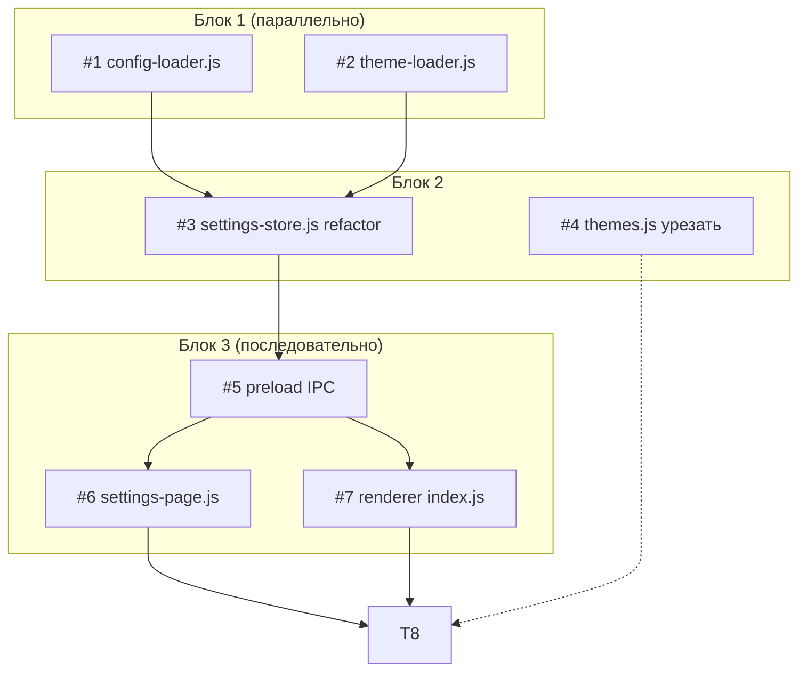

# План реализации: Конфиг (Внешний конфиг + темы)

## Обзор

Создаём два новых loader-модуля (`config-loader.js`, `theme-loader.js`), рефакторим `settings-store.js` в оркестратор, обновляем IPC и renderer для динамической загрузки тем. Все текущие темы кроме `dark`/`light` выносим во внешние `.json` файлы с авто-инициализацией при первом старте.

## Задачи

### Блок 1 — Загрузчики (параллельно)

| # | Задача | Файлы | Зависит от | Режим выполнения | Проверка |
|---|--------|-------|------------|------------------|----------|
| 1 | Создать `config-loader.js`: чтение `config.json`, валидация, deep merge, fallback, alert при крит. ошибках | `src/main/config-loader.js` | — | parallel-subagent | `npm run dev` стартует; ручная проверка удаления `config.json` → recreation |
| 2 | Создать `theme-loader.js`: сканирование `themes/`, парсинг `.json`, валидация полей, skip невалидных, skip дублей `id`, fallback на built-in | `src/main/theme-loader.js` | — | parallel-subagent | `npm run dev` стартует; ручная проверка папки `themes/` → инициализация |

### Блок 2 — Оркестрация и темы (последовательно после #1, #2)

| # | Задача | Файлы | Зависит от | Режим выполнения | Проверка |
|---|--------|-------|------------|------------------|----------|
| 3 | Рефакторинг `settings-store.js` в оркестратор: вызов #1 + #2, агрегация `{config, themes, warnings}`, сохранение только `config` | `src/main/settings-store.js` | 1, 2 | sequential | `npm run dev`; settings-page открывается |
| 4 | Урезать `themes.js` до 2-х built-in тем (`dark`, `light`), остальные — данные для инициализации `theme-loader.js` | `src/renderer/themes.js` | — | parallel-same | `npm run dev` стартует, UI не ломается |

### Блок 3 — IPC и renderer (последовательно после #3)

| # | Задача | Файлы | Зависит от | Режим выполнения | Проверка |
|---|--------|-------|------------|------------------|----------|
| 5 | Обновить `preload/index.js`: `settings:load` возвращает `{config, themes, warnings}`, `settings:save` пишет только `config` | `src/preload/index.js` | 3 | sequential | DevTools console — warnings отображаются |
| 6 | Адаптировать `settings-page.js`: dropdown тем строится динамически из `themes`, а не из hardcoded списка | `src/renderer/settings-page.js` | 3, 5 | sequential | Settings-page показывает все темы, переключение работает |
| 7 | Обновить `index.js` renderer: приём нового формата от `settings:load`, инициализация themes | `src/renderer/index.js` | 3, 5 | parallel-same | `npm run dev` стартует, тема применяется |

### Блок 4 — Финализация

| # | Задача | Файлы | Зависит от | Режим выполнения | Проверка |
|---|--------|-------|------------|------------------|----------|
| 8 | Полная интеграционная проверка: удалить `config.json` и `themes/` → старт → проверить recreation, валидацию, fallback, UI | — | 1..7 | sequential | `npm run dev` + ручные сценарии из checklist |

## Стратегия выполнения

Порядок:
1. Запускаем #1 и #2 параллельно (независимые файлы).
2. После завершения обоих — #3 (settings-store refactor) и #4 (themes.js) можно делать параллельно, но #3 — sequential после #1/#2.
3. После #3 — #5 (preload), затем #6 и #7 параллельно (разные файлы, зависят от #5).
4. После всех — #8 (интеграционная проверка).

## Ревью после каждого шага

- После каждой задачи — сверка с `plan.md` и `spec.md` (скоуп, критерии приёмки).
- Проверка, что изменения не конфликтуют с параллельно выполняемыми задачами (одни и те же файлы, противоречивая логика).
- Если задачу делал субагент — основной агент проводит ревью результата перед следующим шагом.
