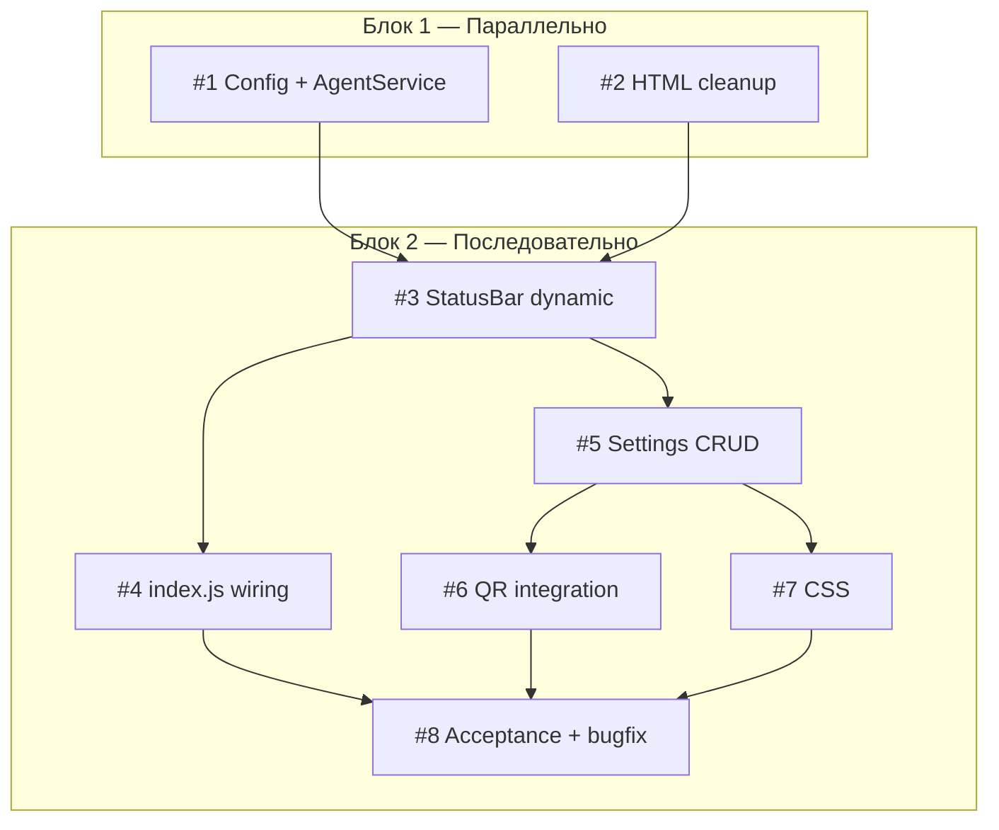

# План реализации: Кастомные ИИ-агенты

## Обзор

8 задач, 2 блока. Блок 1 — независимые подготовительные задачи (параллельно). Блок 2 — последовательные задачи в renderer, каждая следующая зависит от предыдущей.

## Задачи

### Блок 1 — Подготовка (параллельно после инициализации)

| # | Задача | Файлы | Зависит от | Режим выполнения | Проверка |
|---|--------|-------|------------|------------------|----------|
| 1 | **Config + AgentService:** добавить `agents.custom` в defaults; `refresh(customAgents)` принимает и мержит кастомных; `AGENTS_REFRESH` payload передаёт `customAgents` | `src/main/config-loader.js`, `src/main/agent-service.js`, `src/main/ipc-handlers/agents-handlers.js` | — | parallel-subagent | `npm run build` (main) |
| 2 | **HTML cleanup:** удалить 5 hardcoded кнопок из `#status-agents`, оставить только контейнер `#agent-commands-panel` | `src/renderer/index.html` | — | parallel-same | Открыть HTML, проверить что кнопки удалены, контейнеры на месте |

### Блок 2 — Renderer-последовательность (строго по порядку)

| # | Задача | Файлы | Зависит от | Режим выполнения | Проверка |
|---|--------|-------|------------|------------------|----------|
| 3 | **StatusBar dynamic buttons:** заменить `agentButtons[]` на `agentsContainerEl`; добавить `setAgentConfigs(agents)` — генерирует DOM-кнопки с обработчиками; сохранить double-click логику | `src/renderer/status-bar.js` | 1, 2 | sequential | `npm run build` (renderer), визуальная проверка: кнопки встроенных агентов рендерятся |
| 4 | **index.js wiring:** удалить hardcoded `agentCommands`; `applyAgentCommands` формирует маппинг из payload; `launchAgentInActiveTab` ищет по ID; подписка на `settings.changed` обновляет `StatusBar.setAgentConfigs()` + `agentsRefresh()`; `StatusBar` инициализируется с `agentsContainerEl` | `src/renderer/index.js` | 3 | sequential | `npm run build`, запуск `npm run dev`, клик по встроенному агенту — запускается |
| 5 | **SettingsPage CRUD категория:** новая категория «Кастомные ИИ-агенты» — список с DnD, диалог add/edit/delete, поля label/launchCommand/checkCommand/enabled; сохранение в `config.agents.custom`; `_rerenderCustomAgentsCategory()`; `_ensureCustomAgentsSettings()` | `src/renderer/settings-page.js` | 3 | sequential | `npm run dev`, открыть настройки, добавить агента, перезагрузить — сохраняется |
| 6 | **SettingsPage QR integration:** в `_openQuickReplyDialog` показывать toggles для кастомных агентов (только `enabled: true`); использовать `agent.label` для отображения | `src/renderer/settings-page.js` | 5 | sequential | `npm run dev`, открыть QR-диалог, увидеть кастомного агента в списке |
| 7 | **CSS:** добавить стили для кастомных агентов в настройках (аналогично quick-replies: `.settings-custom-agent-*`) | `src/renderer/styles.css` | 5 | sequential | Визуальная проверка: категория в настройках выглядит консистентно |
| 8 | **Acceptance test + bugfix:** проверить все AC из spec.md; исправить найденные проблемы | Все затронутые | 4, 6, 7 | sequential | Ручная проверка всех 8 пунктов AC |

## Стратегия выполнения

- **#1 и #2** независимы, можно делать параллельно (subagent для #1, inline для #2).
- **#3** строго после #1+#2: StatusBar зависит от нового API AgentService и от новой HTML-структуры.
- **#4** строго после #3: index.js вызывает новый StatusBar API.
- **#5** строго после #3: SettingsPage не зависит от index.js напрямую, но обе мутируют StatusBar state, лучше не параллелить.
- **#6** строго после #5: модифициет QR-диалог, созданный в #5.
- **#7** после #5: CSS можно было бы параллельно с #6, но обе — маленькие, делаем последовательно.
- **#8** финальный integration test после всего renderer-блока.

## Ревью после каждого шага

- После каждой задачи — сверка с `plan.md` и `spec.md` (скоуп, критерии приёмки).
- Проверка, что изменения не конфликтуют с параллельно выполнёнными задачами (#1 и #2 независимы, #5/#6/#7 — последовательны).
- После задачи #3 — убедиться, что встроенные кнопки всё ещё работают (обратная совместимость).
- После задачи #4 — полный end-to-end запуск: клик по встроенному агенту → терминал получает команду.
- После задачи #8 — отметить все AC в `spec.md` как выполненные.
