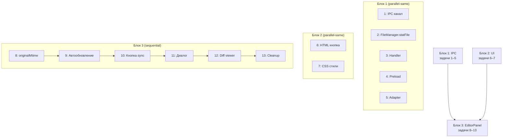

# План реализации: Синхронизация открытого файла с диском

## Обзор

Фича добавляет отслеживание внешних изменений файлов в панель редактора. Реализация разбита на два блока: **IPC-инфраструктура** (канал `fs:stat-file`) и **логика редактора** (mtime, автообновление, кнопка синхронизации, диалог конфликта, diff viewer).

## Задачи

### Блок 1 — IPC инфраструктура (параллельно в одной сессии)

| # | Задача | Файлы | Зависит от | Режим выполнения | Проверка |
|---|--------|-------|------------|------------------|----------|
| 1 | Добавить IPC канал `FS_STAT_FILE` | `src/shared/ipc-channels.js` | — | parallel-same | Проверить, что канал добавлен в объект `IPC_CHANNELS` |
| 2 | Добавить `statFile()` в FileManager | `src/main/file-manager.js` | — | parallel-same | Метод возвращает `{ success, mtimeMs, size }` или `{ success: false, error }` |
| 3 | Добавить handler `FS_STAT_FILE` | `src/main/ipc-handlers/fs-handlers.js` | — | parallel-same | Handler вызывает `fileManager.statFile()` и возвращает результат |
| 4 | Добавить `fsStatFile` в preload | `src/preload/index.js` | — | parallel-same | Bridge `ipcRenderer.invoke(IPC_CHANNELS.FS_STAT_FILE, { filePath })` |
| 5 | Добавить `fsStatFile` в адаптер | `src/renderer/core/adapters/electron-api.js` | — | parallel-same | Адаптер-метод `fsStatFile(path)` делегирует в `_api` |

### Блок 2 — UI элементы (параллельно с Блоком 1, независимы)

| # | Задача | Файлы | Зависит от | Режим выполнения | Проверка |
|---|--------|-------|------------|------------------|----------|
| 6 | HTML: кнопка синхронизации | `src/renderer/index.html` | — | parallel-same | Кнопка `#btn-sync-file` добавлена внутри `#editor-status` |
| 7 | CSS: стили кнопки и диалога | `src/renderer/styles.css` | 6 | parallel-same | Стили `.editor-sync-btn`, `.sync-outdated`, `.conflict-dialog-overlay`, `.conflict-dialog`, `.conflict-dialog-body`, `.conflict-diff-panel` |

### Блок 3 — Логика EditorPanel (последовательно после Блока 1)

| # | Задача | Файлы | Зависит от | Режим выполнения | Проверка |
|---|--------|-------|------------|------------------|----------|
| 8 | Хранение `originalMtime` в табе | `src/renderer/editor-panel.js` | 1–5 | sequential | При `openFile` сохраняется `originalMtime`; при `saveActiveFile` обновляется; в `_createEditorView`/`suspendState`/`restoreState` mtime передаётся корректно |
| 9 | Автообновление при `openFile` и `_switchToTab` | `src/renderer/editor-panel.js` | 8 | sequential | Чистый файл (`modified === false`) → `fsStatFile` + если `mtime` новее → перезагрузить содержимое. Грязный файл → только подсветить кнопку синхронизации (`sync-outdated`) |
| 10 | Кнопка синхронизации | `src/renderer/editor-panel.js` | 8, 6 | sequential | Click-handler: `fsStatFile` → если чистый и новее mtime → перезагрузить; если грязный и новее → `_showConflictDialog`. В `_setupListeners` подписка, в `destroy()` отписка |
| 11 | Диалог конфликта | `src/renderer/editor-panel.js` | 10 | sequential | Overlay `.conflict-dialog-overlay` с тремя кнопками («Оставить мои», «Загрузить с диска», «Показать diff»). Обработчики: keep → закрыть; reload → `_reloadTabContent`; diff → `_showConflictDiff` |
| 12 | Diff viewer | `src/renderer/editor-panel.js` | 11 | sequential | Внутри того же overlay — две read-only панели (textarea с `readonly`) для текущего содержимого редактора и версии с диска. Кнопки «Оставить мои» и «Загрузить с диска» под панелями. Переиспользует `_reloadTabContent` |
| 13 | Cleanup и интеграция | `src/renderer/editor-panel.js` | 12 | sequential | Убедиться, что `destroy()` удаляет overlay, отписывает listener кнопки синхронизации. Убедиться, что `hasUnsavedChanges` / `getOpenFiles` не затронуты. Проверить `suspendState`/`restoreState` на сохранение/восстановление `originalMtime` |

## Стратегия выполнения

### Порядок выполнения

1. **Блоки 1 и 2** — выполняются параллельно в одной сессии (нет пересечения файлов). 5 минут.
2. **Блок 3** — строго после завершения Блоков 1 и 2, т.к. EditorPanel зависит от IPC канала и UI-элементов. Выполняется последовательно задача за задачей.
3. **После каждой задачи Блока 3** — проверка: `npm start` (или аналогичная команда запуска Electron) для ручной проверки поведения. Если запуск сложен — достаточно проверки кода на соответствие spec.md.

## Ревью после каждого шага

> Инструкция для исполнителя:
>
> - После каждой задачи — сверка с `plan.md` и `spec.md` (скоуп, критерии приёмки).
> - Проверка, что изменения не конфликтуют с параллельно выполняемыми задачами (особенно Блоки 1 и 2 — убедиться, что имена CSS-классов не противоречат).
> - После работы субагента — ревью результата перед следующим шагом.
> - После завершения Блока 3 — полный прогон критериев приёмки (CA-1..CA-10) из `spec.md`.
