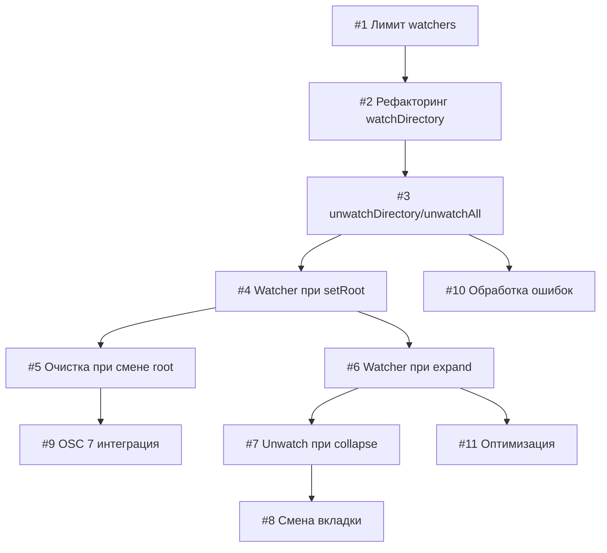

# План реализации: Рекурсивное отслеживание файловой системы

## Обзор

Доработка системы отслеживания файловой системы для полного покрытия корневой директории и всех раскрытых поддиректорий с автоматическим управлением watchers.

## Задачи

### Блок 1 — Core Watchers (последовательно)

| # | Задача | Файлы | Зависит от | Режим выполнения | Проверка |
|---|--------|-------|------------|------------------|----------|
| 1 | Добавить лимит watchers в FileManager (max 100) | `src/main/file-manager.js` | — | sequential | `npm run dev`, проверить консоль на warning при превышении |
| 2 | Рефакторинг watchDirectory: возвращать watcher ID, отслеживать активные | `src/main/file-manager.js` | 1 | sequential | Юнит-тест: создать/удалить watcher |
| 3 | Добавить unwatchDirectory по ID и unwatchAll | `src/main/file-manager.js` | 2 | sequential | Юнит-тест: unwatchAll очищает все watchers |

### Блок 2 — Рекурсивное отслеживание (последовательно после Блока 1)

| # | Задача | Файлы | Зависит от | Режим выполнения | Проверка |
|---|--------|-------|------------|------------------|----------|
| 4 | Создавать watcher при setRoot (корневая директория) | `src/main/file-manager.js` | 3 | sequential | `npm run dev`, проверить что корневая директория отслеживается |
| 5 | Удалять все watchers при смене корневой директории | `src/main/file-manager.js` | 4 | sequential | Проверить через `lsof` или console.log что старые watchers удалены |
| 6 | Создавать watcher при expand папки в FileTree | `src/renderer/file-tree.js` | 4 | sequential | Открыть папку в UI, проверить что watcher создан (console.log) |
| 7 | Удалять watcher при collapse папки в FileTree | `src/renderer/file-tree.js` | 6 | sequential | Свернуть папку, проверить что watcher удалён |

### Блок 3 — Интеграция с вкладками (последовательно после Блока 2)

| # | Задача | Файлы | Зависит от | Режим выполнения | Проверка |
|---|--------|-------|------------|------------------|----------|
| 8 | Очищать watchers при смене вкладки | `src/renderer/file-tree.js`, `src/renderer/tab-bar.js` | 7 | sequential | Переключить вкладку, проверить что watchers очищены и созданы для новой CWD |
| 9 | Обрабатывать OSC 7 для смены корневой директории автоматически | `src/renderer/file-tree.js` | 5 | sequential | В терминале выполнить `cd`, проверить что дерево обновилось и watchers пересозданы |

### Блок 4 — Оптимизация и edge cases (параллельно после Блока 2)

| # | Задача | Файлы | Зависит от | Режим выполнения | Проверка |
|---|--------|-------|------------|------------------|----------|
| 10 | Обработка ошибок EMFILE/ENOENT в watchers | `src/main/file-manager.js` | 3 | parallel-same | Симулировать ошибки, проверить graceful degradation |
| 11 | Оптимизация: не создавать watcher для папок без подпапок | `src/main/file-manager.js`, `src/renderer/file-tree.js` | 6 | parallel-same | Проверить производительность на больших директориях |

## Стратегия выполнения

### Порядок задач

**Цепочка A (Core):** 1 → 2 → 3 → 4 → 5 → 9
**Цепочка B (UI):** 4 → 6 → 7 → 8  
**Цепочка C (Error handling):** 3 → 10 (параллельно с 4+)
**Цепочка D (Optimization):** 6 → 11 (параллельно с 7+)

### Режимы

- **sequential**: строго по порядку, каждая следующая зависит от предыдущей
- **parallel-same**: можно выполнять параллельно в одной сессии (10, 11 не зависят друг от друга и могут идти параллельно с другими задачами после зависимостей)

## Ревью после каждого шага

- После каждой задачи — сверка с `plan.md` и `spec.md` (покрытие требований REQ-1…REQ-6)
- Проверка отсутствия конфликтов с параллельными задачами (особенно 10, 11)
- После работы субагента — ревью результата перед следующим шагом
- Проверка, что watchers не утекают (проверить через Performance Monitor в DevTools)
