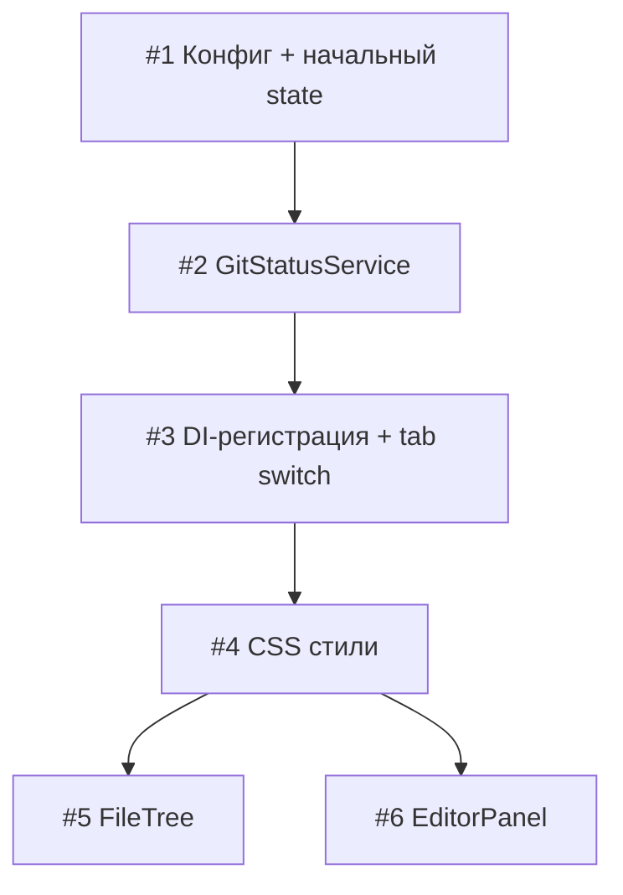

# План реализации: Подсветка git diff

## Обзор

Реализация разбита на 3 блока: сначала инфраструктура (конфиг + сервис + DI-регистрация), затем CSS, затем параллельно два компонента (FileTree и EditorPanel). Компоненты независимы по файлам и могут выполняться параллельно.

## Задачи

### Блок 1 — Инфраструктура (последовательно)

| # | Задача | Файлы | Зависит от | Режим выполнения | Проверка |
|---|--------|-------|------------|------------------|----------|
| 1 | Добавить `GIT_STATUS_POLL_INTERVAL: 5000` в app-config; добавить начальные ключи `git: { isRepo: false, rootPath: null, fileStatuses: {} }` в initialState StateStore в index.js | `src/renderer/core/config/app-config.js`, `src/renderer/index.js` | — | sequential | приложение запускается без ошибок |
| 2 | Создать `GitStatusService`: constructor принимает `{ api, eventBus, store }`; методы `init(rootPath)`, `setRootPath(path)`, `destroy()`; polling через `setInterval(GIT_STATUS_POLL_INTERVAL)`; публикует `git:status-updated` в EventBus; кладёт данные в store; слушает `editor:file-saved` для немедленного переопроса | `src/renderer/services/git-status-service.js` | 1 | sequential | сервис инстанциируется без ошибок; в консоли виден polling |
| 3 | Зарегистрировать `GitStatusService` в DI Container в index.js; вызывать `setRootPath` на событии переключения вкладки (`tab:switched` EventBus); вызывать `setRootPath(null)` при отсутствии rootPath; вызывать `destroy()` в cleanup | `src/renderer/index.js` | 2 | sequential | при переключении вкладки в консоли меняется rootPath; polling стартует/стопается |

### Блок 2 — CSS (последовательно)

| # | Задача | Файлы | Зависит от | Режим выполнения | Проверка |
|---|--------|-------|------------|------------------|----------|
| 4 | Добавить стили файлового дерева: `.git-status-new` (color: var(--green)), `.git-status-modified` (color: var(--accent)), `.git-status-deleted` (color: var(--red), text-decoration: line-through), `.git-dot` (цветной dot 6px рядом с именем папки). Добавить стили редактора: `.cm-diff-gutter` (ширина gutter), `.diff-gutter-bar` (width: 3px, height: 100%), `.diff-gutter-added` (background: var(--green)), `.diff-gutter-modified` (background: var(--accent)) | `src/renderer/styles.css` | 3 | sequential | стили видны в DevTools |

### Блок 3 — Компоненты (параллельно после #4)

| # | Задача | Файлы | Зависит от | Режим выполнения | Проверка |
|---|--------|-------|------------|------------------|----------|
| 5 | FileTree: подписаться на `store.subscribe('git.fileStatuses')`; при построении/обновлении узла — сопоставить абсолютный путь файла с relPath (через `gitRoot` из store); добавить класс `.git-status-new / modified / deleted` на `.tree-name`; для папок — добавить/убрать `.git-dot` элемент с нужным цветом (приоритет: deleted > modified > new), только для уже загруженных поддиректорий; при `git.isRepo === false` — убрать все классы | `src/renderer/file-tree.js` | 4 | parallel-subagent | изменённые файлы подсвечены в дереве; папки с изменёнными файлами получают dot |
| 6 | EditorPanel: добавить CodeMirror extension — `StateField` для хранения diff-данных `{ line, type }[]` + `gutter()` с `DiffMarker extends GutterMarker`; метод `_fetchAndApplyDiff(filePath)` — вызывает `api.gitGetDiff`, парсит unified diff (определяет номера строк и тип: 'added'/'modified'), вызывает `view.dispatch({ effects: setDiffData.of(...) })`; подписаться на EventBus `git:status-updated` → если текущий файл в `git.fileStatuses` — вызвать `_fetchAndApplyDiff`, иначе очистить; вызывать `_fetchAndApplyDiff` при открытии файла и при сохранении (`editor:file-saved`); обновить `destroy()` для отписки | `src/renderer/editor-panel.js` | 4 | parallel-subagent | изменённые строки показывают цветную полоску в gutter; при сохранении файла подсветка обновляется |

## Стратегия выполнения

Задачи 1 → 2 → 3 → 4 строго последовательно: каждая является фундаментом для следующей. После задачи 4 задачи 5 и 6 выполняются параллельно (разные файлы, независимая логика).

## Ревью после каждого шага

- После каждой задачи — сверка с `plan.md` и `spec.md`: всё ли из REQ-* покрыто на этом шаге.
- Задачи 5 и 6 — независимы, но оба компонента подписываются на одни и те же события EventBus (`git:status-updated`) и одни и те же ключи store — убедиться, что имена совпадают с тем, что публикует GitStatusService (задача 2/3).
- Если задачи 5 и 6 выполняет субагент — перед следующим шагом основной агент проверяет: корректность нормализации путей (relPath vs absPath), отсутствие прямых вызовов `window.electronAPI`, наличие `destroy()` с отпиской.
- Коммит после завершения Блока 1, после Блока 2, после Блока 3.
