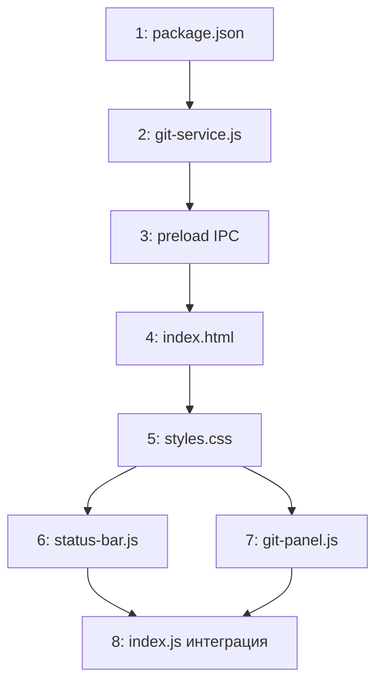

# План реализации: Git Panel

## Обзор

8 задач в 4 блоках. Блоки 1–2 строго последовательны. Блок 3 — два класса JS параллельно. Блок 4 — финальная интеграция.

---

## Задачи

### Блок 1 — Инфраструктура (последовательно)

| # | Задача | Файлы | Зависит от | Режим выполнения | Проверка |
|---|--------|-------|------------|------------------|----------|
| 1 | Добавить `simple-git` в зависимости | `package.json` | — | sequential | `npm install` проходит |
| 2 | Создать `git-service.js` со всеми git-операциями и IPC-хендлерами | `src/main/git-service.js` | 1 | sequential | файл создан, импорт в `index.js` main не ломает запуск |
| 3 | Зарегистрировать git* IPC-каналы в preload | `src/preload/index.js` | 2 | sequential | приложение запускается, `window.api.gitGetStatus` существует |

**Задача 2 — детали `git-service.js`:**

Экспортировать функцию `registerGitHandlers(ipcMain)`, внутри которой регистрируются все `ipcMain.handle()`:

```
git:get-status   (rootPath) → { branch, ahead, behind, files: [{path, additions, deletions}], totalAdditions, totalDeletions }
git:get-diff     (rootPath, filePath) → строка unified diff
git:get-branches (rootPath) → { current, all: string[] }
git:checkout     (rootPath, branch) → { ok } | { error }
git:create-branch(rootPath, name)   → { ok } | { error }
git:delete-branch(rootPath, name)   → { ok } | { error }
git:commit       (rootPath, message)→ { ok } | { error }
git:push         (rootPath)         → { ok } | { error }
git:discard      (rootPath)         → { ok } | { error }
```

Все операции в try/catch. `git:get-status` возвращает `{ notARepo: true }` если директория — не git-репозиторий. `git:discard` выполняет `git.checkout('.')` + `git.clean('f', ['-d'])`.

**Задача 3 — детали preload:**

Добавить в `contextBridge.exposeInMainWorld('api', { ... })`:
```js
gitGetStatus: (rootPath) => ipcRenderer.invoke('git:get-status', rootPath),
gitGetDiff: (rootPath, filePath) => ipcRenderer.invoke('git:get-diff', rootPath, filePath),
gitGetBranches: (rootPath) => ipcRenderer.invoke('git:get-branches', rootPath),
gitCheckout: (rootPath, branch) => ipcRenderer.invoke('git:checkout', rootPath, branch),
gitCreateBranch: (rootPath, name) => ipcRenderer.invoke('git:create-branch', rootPath, name),
gitDeleteBranch: (rootPath, name) => ipcRenderer.invoke('git:delete-branch', rootPath, name),
gitCommit: (rootPath, message) => ipcRenderer.invoke('git:commit', rootPath, message),
gitPush: (rootPath) => ipcRenderer.invoke('git:push', rootPath),
gitDiscard: (rootPath) => ipcRenderer.invoke('git:discard', rootPath),
```

---

### Блок 2 — HTML и CSS (последовательно, после блока 1)

| # | Задача | Файлы | Зависит от | Режим выполнения | Проверка |
|---|--------|-------|------------|------------------|----------|
| 4 | Добавить `#status-bar` и `#git-overlay` в HTML | `src/renderer/index.html` | 3 | sequential | элементы присутствуют в DOM |
| 5 | Написать CSS для status-bar и git-panel | `src/renderer/styles.css` | 4 | sequential | визуальный осмотр в dev-режиме |

**Задача 4 — детали HTML:**

`#status-bar` — после закрывающего тега `#workspace`:
```html
<div id="status-bar">
  <button id="btn-git-diff" class="status-bar-btn hidden">± +0 -0</button>
</div>
```

`#git-overlay` — после `#status-bar`, изначально скрыт:
```html
<div id="git-overlay" class="hidden">
  <div class="git-header">
    <span class="git-title">Git</span>
    <div class="git-branch-controls">
      <select id="git-branch-select"></select>
      <button id="git-branch-new">+ New</button>
      <button id="git-branch-delete">🗑</button>
    </div>
    <button class="git-close">✕</button>
  </div>
  <div class="git-error" id="git-error-bar"></div>
  <div class="git-actions">
    <input type="text" id="git-commit-msg" placeholder="commit message...">
    <button id="git-btn-commit">Commit</button>
    <button id="git-btn-push">Push</button>
    <button id="git-btn-discard">Discard all</button>
  </div>
  <div class="git-file-list" id="git-file-list"></div>
</div>
```

**Задача 5 — детали CSS:**

```css
/* Status Bar */
#status-bar {
  height: 22px;
  background: var(--surface);
  border-top: 1px solid var(--border);
  display: flex;
  align-items: center;
  padding: 0 8px;
  flex-shrink: 0;
}
.status-bar-btn {
  font-size: 11px;
  padding: 1px 6px;
  border: 1px solid var(--border);
  border-radius: 3px;
  background: transparent;
  color: var(--text);
  cursor: pointer;
}
.status-bar-btn:hover { background: var(--border); }

/* Git Overlay */
#git-overlay {
  position: fixed;
  inset: 38px 0 22px 0;
  background: var(--bg);
  z-index: 500;
  display: flex;
  flex-direction: column;
}
#git-overlay.hidden { display: none; }

.git-header {
  display: flex;
  align-items: center;
  gap: 8px;
  padding: 8px 12px;
  border-bottom: 1px solid var(--border);
  flex-shrink: 0;
}
.git-title { font-weight: 600; color: var(--text); margin-right: 8px; }
.git-branch-controls { display: flex; align-items: center; gap: 6px; flex: 1; }
#git-branch-select {
  background: var(--surface);
  border: 1px solid var(--border);
  color: var(--text);
  padding: 2px 6px;
  border-radius: 4px;
  font-size: 12px;
}
.git-close {
  margin-left: auto;
  background: none;
  border: none;
  color: var(--muted);
  cursor: pointer;
  font-size: 14px;
}
.git-close:hover { color: var(--red); }

#git-error-bar {
  font-size: 12px;
  color: var(--red);
  padding: 4px 12px;
  min-height: 0;
  display: none;
}
#git-error-bar.visible { display: block; }

.git-actions {
  display: flex;
  align-items: center;
  gap: 6px;
  padding: 8px 12px;
  border-bottom: 1px solid var(--border);
  flex-shrink: 0;
}
#git-commit-msg {
  flex: 1;
  background: var(--surface);
  border: 1px solid var(--border);
  color: var(--text);
  padding: 4px 8px;
  border-radius: 4px;
  font-size: 12px;
}
#git-commit-msg:focus { border-color: var(--accent); outline: none; }

.git-file-list {
  flex: 1;
  overflow-y: auto;
  padding: 4px 0;
}

.git-file-row {
  display: flex;
  align-items: center;
  gap: 6px;
  padding: 4px 12px;
  cursor: pointer;
  font-size: 12px;
  font-family: Menlo, 'SF Mono', Consolas, monospace;
  user-select: none;
}
.git-file-row:hover { background: var(--surface); }
.git-file-arrow { color: var(--muted); width: 10px; transition: transform 0.15s; }
.git-file-row.expanded .git-file-arrow { transform: rotate(90deg); }
.git-file-path { flex: 1; color: var(--text); }
.git-additions { color: var(--green); }
.git-deletions { color: var(--red); }

.git-diff-block {
  display: none;
  font-family: Menlo, 'SF Mono', Consolas, monospace;
  font-size: 11px;
  padding: 4px 0;
  border-bottom: 1px solid var(--border);
}
.git-diff-block.visible { display: block; }
.diff-line { padding: 0 12px 0 40px; white-space: pre; }
.diff-line-add { background: rgba(166,227,161,0.12); color: var(--green); }
.diff-line-del { background: rgba(243,139,168,0.12); color: var(--red); }
.diff-line-hunk { color: var(--muted); font-style: italic; }
```

---

### Блок 3 — JS классы (параллельно, после блока 2)

| # | Задача | Файлы | Зависит от | Режим выполнения | Проверка |
|---|--------|-------|------------|------------------|----------|
| 6 | Создать `status-bar.js` — класс StatusBar | `src/renderer/status-bar.js` | 5 | parallel-subagent | кнопка обновляется, скрывается если нет git |
| 7 | Создать `git-panel.js` — класс GitPanel | `src/renderer/git-panel.js` | 5 | parallel-subagent | оверлей открывается/закрывается, все операции работают |

**Задача 6 — StatusBar:**

```js
export class StatusBar {
  constructor({ btnEl, onOpen })
  start(getRootPath)   // запускает polling каждые 5с; getRootPath — функция → string
  stop()               // clearInterval
  updateNow()          // внеплановое обновление (вызывается при смене вкладки)
  // private
  _poll()              // вызывает window.api.gitGetStatus(rootPath), обновляет btnEl
}
```

Логика `_poll()`:
- Если нет rootPath — скрыть кнопку.
- Вызвать `window.api.gitGetStatus(rootPath)`.
- Если `result.notARepo` — скрыть кнопку.
- Иначе — показать кнопку, текст `± +${totalAdditions} -${totalDeletions}`.

**Задача 7 — GitPanel:**

```js
export class GitPanel {
  constructor({ overlayEl, onClose })
  show(rootPath)    // открыть, загрузить статус + ветки
  hide()            // скрыть
  isVisible()       // boolean
  // private
  _loadStatus()     // git:get-status → обновить список файлов + кнопки
  _loadBranches()   // git:get-branches → заполнить <select>
  _renderFileList(files)
  _renderDiff(filePath)   // git:get-diff → парсинг + рендер
  _parseDiff(diffStr)     // unified diff → [{type: 'add'|'del'|'ctx'|'hunk', content}]
  _showError(msg)         // показать #git-error-bar на 4с
  _showSuccess(msg)       // зелёная строка на 2с (переиспользует #git-error-bar с классом)
  _setActionsDisabled(bool)
  _confirmDiscard()       // инлайн-замена кнопок на «Да / Нет»
}
```

Обработчики событий инициализируются в конструкторе: `Esc` → `hide()`, `.git-close` → `hide()`, `#git-branch-select` change → checkout, `#git-branch-new` → инлайн-инпут, `#git-branch-delete` → delete, `#git-btn-commit` → commit, `#git-btn-push` → push, `#git-btn-discard` → confirmDiscard.

---

### Блок 4 — Интеграция (последовательно, после #6 + #7)

| # | Задача | Файлы | Зависит от | Режим выполнения | Проверка |
|---|--------|-------|------------|------------------|----------|
| 8 | Инициализировать StatusBar и GitPanel в index.js; вызвать `registerGitHandlers` в main | `src/renderer/index.js`, `src/main/index.js` | 6, 7 | sequential | e2e: кнопка → панель → операции |

**Задача 8 — детали:**

В `src/main/index.js`:
```js
import { registerGitHandlers } from './git-service.js'
// в app.whenReady():
registerGitHandlers(ipcMain)
```

В `src/renderer/index.js`:
```js
import { StatusBar } from './status-bar.js'
import { GitPanel } from './git-panel.js'

const gitPanel = new GitPanel({
  overlayEl: document.getElementById('git-overlay'),
  onClose: () => statusBar.updateNow(),
})

const statusBar = new StatusBar({
  btnEl: document.getElementById('btn-git-diff'),
  onOpen: () => gitPanel.show(tabBar.getActive().rootPath),
})

statusBar.start(() => tabBar.getActive()?.rootPath)

// При смене вкладки — обновить StatusBar
tabBar.onSwitch = (tab) => {
  // ... существующая логика
  statusBar.updateNow()
}
```

---

## Стратегия выполнения

Задачи 1 → 2 → 3 → 4 → 5 строго последовательно: каждый шаг — фундамент для следующего.

После задачи 5: задачи **6 и 7 запускаются параллельно** (разные файлы, нет общего состояния).

После завершения обеих: задача **8 — финальная интеграция**.



## Ревью после каждого шага

- После каждой задачи — сверка с `plan.md` и `spec.md` (все REQ покрыты?).
- Перед задачей 8 — проверить что 6 и 7 не конфликтуют (разные файлы, `window.api` используют одинаково).
- Если задачи 6/7 делал субагент — основной агент проверяет результат перед задачей 8.
- Коммит после каждого блока (не после каждой задачи).
