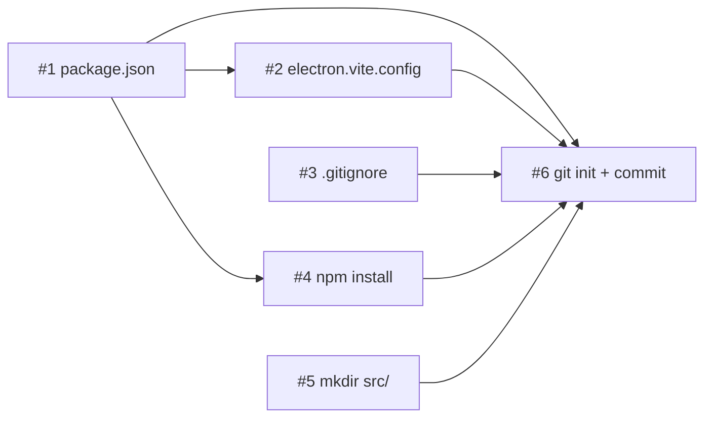

# План реализации: Инициализация проекта

## Обзор

Создание скелета Electron-проекта: конфигурационные файлы, установка зависимостей с пересборкой нативных модулей, структура директорий, инициализация git. Все задачи строго последовательные — каждая зависит от предыдущей.

## Задачи

### Блок 1 — Конфигурация проекта (последовательно)

| # | Задача | Файлы | Зависит от | Режим выполнения | Проверка |
|---|--------|-------|------------|------------------|----------|
| 1 | Создать `package.json` с зависимостями и скриптами (REQ-1, REQ-2, REQ-3) | `package.json` | — | sequential | JSON валиден, содержит все пакеты |
| 2 | Создать `electron.vite.config.mjs` (REQ-5) | `electron.vite.config.mjs` | 1 | sequential | Файл содержит `externalizeDepsPlugin()` для main и preload |
| 3 | Создать `.gitignore` (REQ-6) | `.gitignore` | — | parallel-same | Файл содержит `node_modules/`, `out/`, `dist/`, `.DS_Store`, `*.log` |

### Блок 2 — Установка зависимостей (последовательно, после блока 1)

| # | Задача | Файлы | Зависит от | Режим выполнения | Проверка |
|---|--------|-------|------------|------------------|----------|
| 4 | Выполнить `npm install` (REQ-4) | `package-lock.json`, `node_modules/` | 1 | sequential | Установка без ошибок, `postinstall` (electron-rebuild) — `Rebuild Complete` |

### Блок 3 — Структура и git (последовательно, после блока 2)

| # | Задача | Файлы | Зависит от | Режим выполнения | Проверка |
|---|--------|-------|------------|------------------|----------|
| 5 | Создать директории `src/main/`, `src/preload/`, `src/renderer/` (REQ-7) | `src/main/`, `src/preload/`, `src/renderer/` | — | parallel-same | Директории существуют |
| 6 | Инициализировать git и сделать первый коммит (REQ-8) | `.git/` | 1, 2, 3, 4, 5 | sequential | `git log` показывает коммит; в коммите: package.json, package-lock.json, electron.vite.config.mjs, .gitignore |

## Стратегия выполнения

1. Задачи #1 и #3 можно создать параллельно (не зависят друг от друга, разные файлы).
2. Задача #2 — после #1 (использует контекст package.json, хотя формально независима по содержимому).
3. Задача #4 — строго после #1 (нужен package.json для `npm install`).
4. Задача #5 — можно параллельно с #4 (создание директорий не зависит от установки).
5. Задача #6 — последняя, зависит от всех предыдущих (всё должно быть готово для коммита).

## Ревью после каждого шага

- После каждой задачи — сверка с `plan.md` и `spec.md` (скоуп, критерии приёмки).
- Проверка, что изменения не конфликтуют с параллельно выполняемыми задачами (одни и те же файлы, противоречивая логика).
- Если задачу делал субагент — основной агент проводит ревью результата перед следующим шагом.
- После задачи #4: убедиться, что `electron-rebuild` завершился успешно (в выводе есть `Rebuild Complete`). Если нет — проверить Xcode Command Line Tools.
- После задачи #6: `git log --oneline` и `git status` должны показать чистый репозиторий с одним коммитом.
