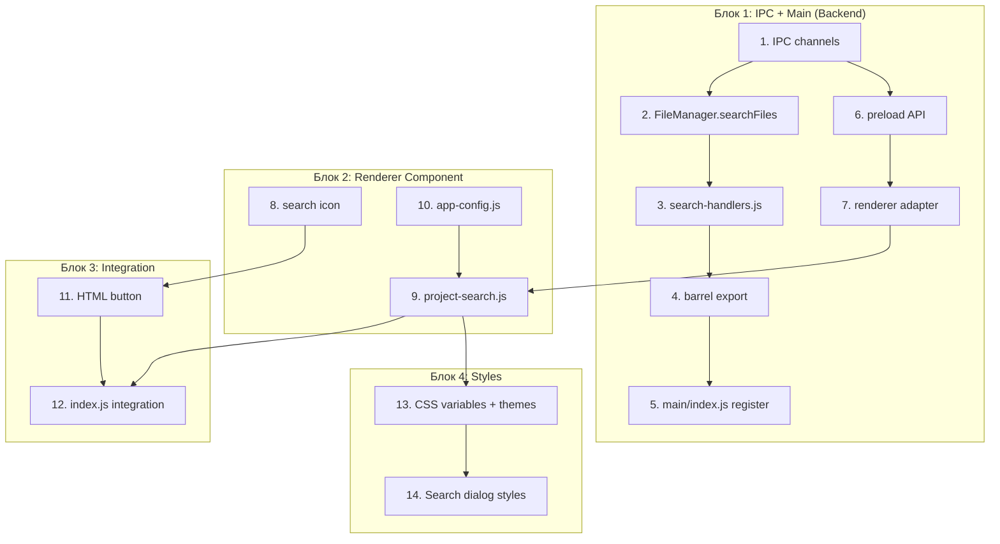

# План реализации: Поиск по проекту

## Обзор

Реализация фичи "Поиск по проекту" разбита на 4 блока: IPC/Backend (main), Renderer-компонент, Bootstrap/интеграция, и стили/иконки. Сначала строим backend (main-процесс), затем renderer UI, затем интегрируем в приложение.

## Задачи

### Блок 1 — IPC и backend поиска (main + shared)

| # | Задача | Файлы | Зависит от | Режим выполнения | Проверка |
|---|--------|-------|------------|------------------|----------|
| 1 | Добавить константы IPC-каналов в `shared/ipc-channels.js` | `src/shared/ipc-channels.js` | — | sequential | grep SEARCH_ |
| 2 | Добавить метод `searchFiles()` в `FileManager` | `src/main/file-manager.js` | — | sequential | чтение кода |
| 3 | Создать `search-handlers.js` в main | `src/main/ipc-handlers/search-handlers.js` | 1, 2 | sequential | чтение кода |
| 4 | Экспортировать search-handlers из barrel | `src/main/ipc-handlers/index.js` | 3 | sequential | чтение кода |
| 5 | Регистрировать search-handlers в `main/index.js` | `src/main/index.js` | 4 | sequential | чтение кода |
| 6 | Добавить методы поиска в preload API | `src/preload/index.js` | 1 | sequential | чтение кода |
| 7 | Добавить адаптерные методы в `ElectronApiAdapter` | `src/renderer/core/adapters/electron-api.js` | 1 | sequential | чтение кода |

### Блок 2 — Renderer-компонент ProjectSearch

| # | Задача | Файлы | Зависит от | Режим выполнения | Проверка |
|---|--------|-------|------------|------------------|----------|
| 8 | Добавить иконку лупы в `icons.js` | `src/renderer/icons.js` | — | sequential | grep search |
| 9 | Создать `project-search.js` — компонент диалога | `src/renderer/project-search.js` | 7, 8 | sequential | чтение кода |
| 10 | Добавить константы поиска в `app-config.js` | `src/renderer/core/config/app-config.js` | — | sequential | grep SEARCH |

### Блок 3 — Интеграция и bootstrap

| # | Задача | Файлы | Зависит от | Режим выполнения | Проверка |
|---|--------|-------|------------|------------------|----------|
| 11 | Добавить кнопку лупы в `index.html` | `src/renderer/index.html` | 8 | sequential | grep btn-search |
| 12 | Интегрировать ProjectSearch в `index.js` (DI, keyboard, events) | `src/renderer/index.js` | 9, 10, 11 | sequential | `npm run build` |

### Блок 4 — Стили и темы

| # | Задача | Файлы | Зависит от | Режим выполнения | Проверка |
|---|--------|-------|------------|------------------|----------|
| 13 | Добавить CSS-переменные в `styles.css` и `themes.js` | `src/renderer/styles.css`, `src/renderer/themes.js` | 9 | sequential | визуальная проверка |
| 14 | Стилизовать диалог поиска | `src/renderer/styles.css` | 9, 13 | sequential | `npm run build` |

## Стратегия выполнения

**Порядок:**
1. Выполнить Блок 1 строго последовательно (зависимости по цепочке).
2. Блок 2 можно начать после T1 (IPC) и параллельно с Блоком 1 после T6 (адаптер готов), но проще — последовательно.
3. Блок 3 — после завершения Блоков 1 и 2.
4. Блок 4 — после завершения Блока 2 (компонент готов, нужны стили).

**Параллельные возможности:**
- T8 (иконка) и T1 (IPC) — независимы, можно параллельно.
- T10 (конфиг) и T1/T8 — независимы.

На практике в одной сессии удобнее выполнять последовательно: Блок 1 → Блок 2 → Блок 3 → Блок 4.

## Ревью после каждого шага

После каждой задачи:
1. Свериться с `spec.md` — покрыты ли требования (REQ-*).
2. Проверить отсутствие конфликтов с параллельными задачами (на практике — нет параллельных правок одних файлов).
3. Запустить `npm run build` после завершения Блока 3.
4. Проверить отсутствие `console.log` (допустим только `electron-log` в main).
5. Убедиться что все IPC-каналы — из `shared/ipc-channels.js`, нет строковых литералов.
6. После каждого логического блока — коммит.
