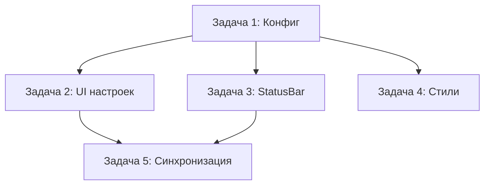

# План реализации: Настройки быстрых ответов

## Обзор

Заменить захардкоженные быстрые ответы (agent commands) на динамические, управляемые через конфиг. Добавить UI в настройки для CRUD операций. Работа разбита на 5 задач: конфиг, UI настроек, статус-бар, стили, связывание.

## Задачи

### Блок 1 — Конфигурация (последовательно)

| # | Задача | Файлы | Зависит от | Режим выполнения | Проверка |
|---|--------|-------|------------|------------------|----------|
| 1 | Добавить `quickReplies` в `getConfigDefaults` и `deepMergeConfig` | `src/main/config-loader.js` | — | sequential | `npm run build` или `node -e "import('./src/main/config-loader.js').then(m=>console.log(JSON.stringify(m.getConfigDefaults(),null,2)))"` |

### Блок 2 — UI и Статус-бар (параллельно после #1)

| # | Задача | Файлы | Зависит от | Режим выполнения | Проверка |
|---|--------|-------|------------|------------------|----------|
| 2 | Добавить категорию «Быстрые ответы» в `SettingsPage` | `src/renderer/settings-page.js` | 1 | parallel-same | Открыть настройки, проверить отображение списка, добавление/удаление/редактирование |
| 3 | Динамические кнопки в `StatusBar` + очистка HTML | `src/renderer/status-bar.js`, `src/renderer/index.html` | 1 | parallel-same | Запустить агента, проверить что кнопки генерируются из конфига |
| 4 | Стили для новых элементов | `src/renderer/styles.css` | 1 | parallel-same | Визуальная консистентность с остальными настройками |

### Блок 3 — Синхронизация (последовательно после #2 и #3)

| # | Задача | Файлы | Зависит от | Режим выполнения | Проверка |
|---|--------|-------|------------|------------------|----------|
| 5 | Подключить `quickReplies` в `index.js`: инициализация `StatusBar`, обработка `onSettingsChanged` | `src/renderer/index.js` | 2, 3 | sequential | Изменить настройки — кнопки в статус-баре обновляются без перезагрузки |

## Стратегия выполнения

1. Выполнить задачу **#1** (конфиг). Это база для всех остальных.
2. Параллельно выполнить **#2** (UI настроек), **#3** (динамические кнопки) и **#4** (стили). Они независимы по файлам и логике.
3. После завершения #2 и #3 выполнить **#5** (связывание в `index.js`), чтобы соединить обновления настроек с реактивным обновлением статус-бара.

## Ревью после каждого шага

- После каждой задачи — сверка с `plan.md` и `spec.md` (скоуп, критерии приёмки).
- Проверка, что изменения не конфликтуют с параллельно выполняемыми задачами (особенно #2 и #3: одинаковые переменные, пересечение по DOM/CSS).
- После работы субагента (если используется) — ревью результата перед следующим шагом.
