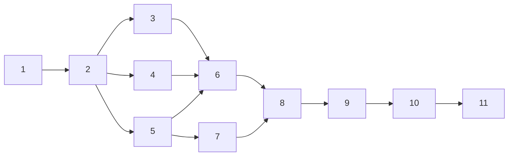

# План реализации: Боковая панель с деревом файлов

## Обзор

Реализация боковой панели с деревом файлов для Electron-терминала eTty. Работа разбита на 4 блока: бэкенд (FileManager + IPC), каркас UI (layout + preload), логика дерева файлов (FileTree + ContextMenu), интеграция и стилизация.

## Задачи

### Блок 1 — Бэкенд: FileManager и IPC (последовательно)

| # | Задача | Файлы | Зависит от | Режим выполнения | Проверка |
|---|--------|-------|------------|------------------|----------|
| 1 | Создать класс FileManager — singleton, обёртка над fs/promises. Методы: readDir, createFile, createDir, rename, delete, copy, getCwd. Валидация путей (path traversal protection относительно CWD) | `src/main/file-manager.js` | — | sequential | Ручная проверка: модуль импортируется без ошибок |
| 2 | Зарегистрировать IPC-хендлеры fs:* в main-процессе. Каналы: fs:read-dir, fs:create-file, fs:create-dir, fs:rename, fs:delete, fs:copy, fs:get-cwd. Ошибки — { success: false, error } | `src/main/index.js` | 1 | sequential | `npm run dev` — приложение запускается без ошибок |

### Блок 2 — Каркас UI: preload + layout (параллельно после #2)

| # | Задача | Файлы | Зависит от | Режим выполнения | Проверка |
|---|--------|-------|------------|------------------|----------|
| 3 | Расширить preload API — добавить методы fsReadDir, fsCreateFile, fsCreateDir, fsRename, fsDelete, fsCopy, getCwd через contextBridge | `src/preload/index.js` | 2 | parallel-subagent | `npm run dev` — electronAPI содержит новые методы (проверка в DevTools console) |
| 4 | Изменить HTML-layout: обернуть терминал в #workspace (flex row), добавить #sidebar (250px) слева от #terminal-container | `src/renderer/index.html` | 2 | parallel-subagent | `npm run dev` — sidebar и терминал отображаются рядом |
| 5 | Добавить базовые CSS-стили sidebar: ширина 250px, фон #181825, бордер, скролл. Стили #workspace (flex row). Убедиться, что terminal-container корректно растягивается | `src/renderer/styles.css` | 2 | parallel-subagent | Визуальная проверка: layout корректен, терминал работает |

### Блок 3 — Логика дерева и контекстное меню (последовательно после блока 2)

| # | Задача | Файлы | Зависит от | Режим выполнения | Проверка |
|---|--------|-------|------------|------------------|----------|
| 6 | Создать класс FileTree — построение DOM-дерева, lazy loading при expand, collapse/expand по клику, сортировка (папки вверху, алфавитно), отступы по глубине, стрелки ▶/▼ для папок | `src/renderer/file-tree.js` | 3, 4, 5 | sequential | `npm run dev` — дерево CWD отображается, папки разворачиваются/сворачиваются |
| 7 | Создать класс ContextMenu — переиспользуемый кастомный DOM-элемент. Принимает массив пунктов [{label, action, separator?}], позицию (x, y), callback. Закрытие по клику вне меню | `src/renderer/context-menu.js` | 5 | sequential | Визуальная проверка: меню появляется и закрывается |
| 8 | Интегрировать ContextMenu с FileTree — right-click на ноде/пустом месте показывает соответствующий набор пунктов (REQ-14). Подключить обработчики для каждой операции | `src/renderer/file-tree.js`, `src/renderer/context-menu.js` | 6, 7 | sequential | Right-click показывает меню с корректными пунктами |

### Блок 4 — Файловые операции и финализация (последовательно после #8)

| # | Задача | Файлы | Зависит от | Режим выполнения | Проверка |
|---|--------|-------|------------|------------------|----------|
| 9 | Реализовать inline-input для создания файла/папки и переименования. Enter — выполнение через electronAPI, Escape — отмена. Обновление дерева после операции | `src/renderer/file-tree.js` | 8 | sequential | Создание файла/папки и переименование работают через inline-input |
| 10 | Реализовать удаление (dialog.showMessageBoxSync через IPC), копировать/вставить (внутренний буфер, суффикс copy при конфликте), копировать путь (clipboard) | `src/renderer/file-tree.js`, `src/main/index.js` | 9 | sequential | Все операции работают: удаление с подтверждением, copy/paste, путь в clipboard |
| 11 | Инициализация FileTree в renderer/index.js. Финальная стилизация: дерево, hover/selected, контекстное меню, inline-input — все цвета Catppuccin Mocha. Проверка fitAddon.fit() при ресайзе | `src/renderer/index.js`, `src/renderer/styles.css` | 10 | sequential | Полный прогон по чеклисту критериев приёмки из spec.md |

## Стратегия выполнения

1. **Задачи #1 → #2** — строго последовательно (IPC зависит от FileManager).
2. **Задачи #3, #4, #5** — параллельно (разные файлы, нет пересечений). Все зависят от #2.
3. **Задача #6** — после #3, #4, #5 (нужен preload API + HTML-контейнер + CSS).
4. **Задача #7** — после #5 (нужны CSS-стили), может выполняться параллельно с #6.
5. **Задачи #8 → #9 → #10 → #11** — строго последовательно.

## Ревью после каждого шага

> Инструкция для исполнителя (дублируется в starter-prompt):
>
> - После каждой задачи — сверка с `plan.md` и `spec.md` (скоуп, критерии приёмки).
> - Проверка, что изменения не конфликтуют с параллельно выполняемыми задачами (одни и те же файлы, противоречивая логика).
> - Если задачу делал субагент — основной агент проводит ревью результата перед следующим шагом.
