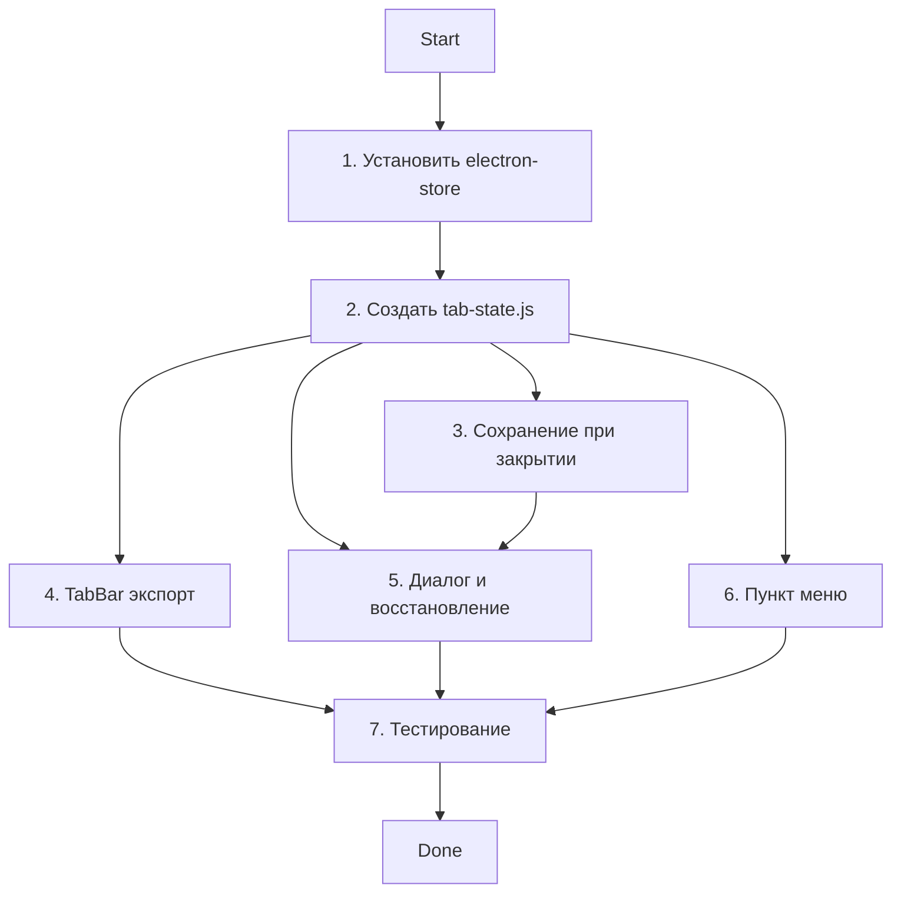

# План реализации: Сохранение состояния вкладок

## Обзор

Реализация состоит из: новый модуль `tab-state.js` для хранения, правки `index.js` для жизненного цикла, интеграция с TabBar, меню.

## Задачи

| # | Задача | Файлы | Зависит от | Режим выполнения | Проверка |
|---|--------|-------|------------|------------------|----------|
| 1 | Установить electron-store | `package.json` | — | sequential | `npm ls electron-store` |
| 2 | Создать tab-state.js | `src/main/tab-state.js` | 1 | sequential | Запуск без ошибок |
| 3 | Интегрировать сохранение в main process | `src/main/index.js` | 2 | sequential | Закрытие создаёт файл |
| 4 | Добавить метод экспорта в TabBar | `src/renderer/tab-bar.js` | — | parallel-same | Нет (логика renderer) |
| 5 | Добавить диалог и восстановление в index.js | `src/main/index.js` | 2, 3 | sequential | Диалог появляется |
| 6 | Добавить пункт меню | `src/menu.js` | 2 | parallel-same | Пункт в меню |
| 7 | Тестирование восстановления | — | 5 | sequential | Вручную |

### Блок 1 — Зависимости и ядро

| # | Задача | Файлы | Зависит от | Режим выполнения | Проверка |
|---|--------|-------|------------|------------------|----------|
| 1 | Установить electron-store | `package.json` | — | sequential | `npm ls electron-store` |
| 2 | Создать tab-state.js | `src/main/tab-state.js` | 1 | sequential | Запуск без ошибок |

### Блок 2 — Интеграция в main process

| # | Задача | Файлы | Зависит от | Режим выполнения | Проверка |
|---|--------|-------|------------|------------------|----------|
| 3 | Интегрировать сохранение при закрытии | `src/main/index.js` | 2 | sequential | Файл создаётся при quit |
| 5 | Добавить диалог и восстановление при старте | `src/main/index.js` | 2, 3 | sequential | Диалог появляется |

### Блок 3 — Renderer и меню (параллельно)

| # | Задача | Файлы | Зависит от | Режим выполнения | Проверка |
|---|--------|-------|------------|------------------|----------|
| 4 | Добавить метод экспорта в TabBar | `src/renderer/tab-bar.js` | — | parallel-same | Нет (логика) |
| 6 | Добавить пункт "Восстановить вкладки" в меню | `src/menu.js` | 2 | parallel-same | Пункт в меню |

### Блок 4 — Тестирование

| # | Задача | Файлы | Зависит от | Режим выполнения | Проверка |
|---|--------|-------|------------|------------------|----------|
| 7 | Тестирование восстановления | — | 5 | sequential | Ручное |

## Стратегия выполнения

**Порядок:**
1. Последовательно: 1 → 2 → 3 → 5 → 7
2. Параллельно с 2: 4, 6

## Ревью после каждого шага

- После каждой задачи — сверка с `plan.md` и `spec.md` (скоуп, критерии приёмки)
- Проверка, что изменения не конфликтуют с параллельно выполняемыми задачами
- После работы субагента — основной агент проводит ревью результата перед следующим шагом
