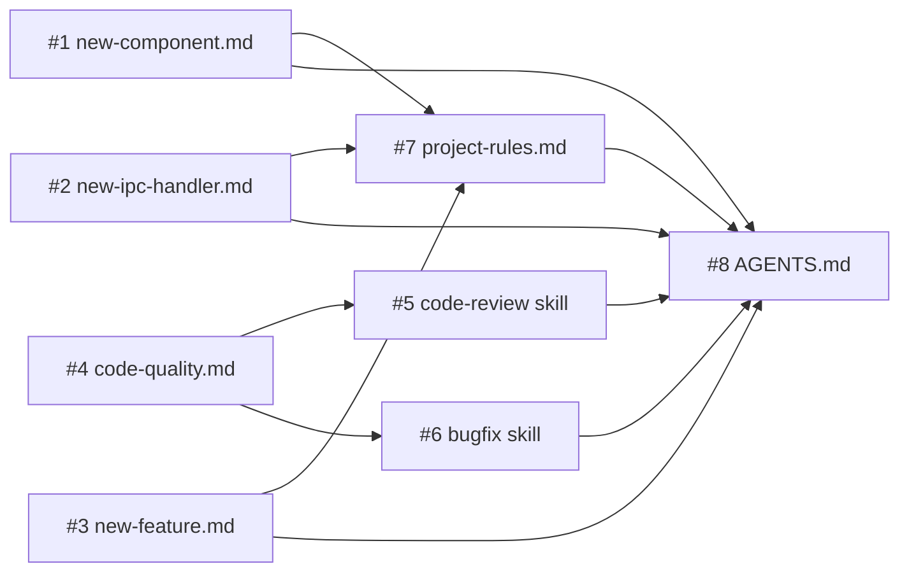

# Best Practice Skills & Documentation — Implementation Plan

> **For agentic workers:** REQUIRED SUB-SKILL: Use superpowers:subagent-driven-development (recommended) or superpowers:executing-plans to implement this plan task-by-task. Steps use checkbox (`- [ ]`) syntax for tracking.

**Goal:** Создать чеклисты, скиллы code-review и bugfix, дополнить AGENTS.md и project-rules.md для автоматического соблюдения best practices при любых изменениях.

**Architecture:** 4 чеклиста в `.agents/rules/checklists/`, 2 скилла в `.agents/skills/`, обновления 2 существующих файлов. Все файлы — Markdown, без кода, без зависимостей.

**Tech Stack:** Markdown, YAML frontmatter (для скиллов)

---

## File Structure

```
.agents/
├── rules/
│   ├── project-rules.md              # MODIFY: добавить секции в конец
│   └── checklists/                   # CREATE directory
│       ├── new-component.md          # CREATE: чеклист нового компонента
│       ├── new-ipc-handler.md        # CREATE: чеклист нового IPC handler
│       ├── new-feature.md            # CREATE: общий чеклист фичи
│       └── code-quality.md           # CREATE: чеклист качества кода
├── skills/
│   ├── code-review/
│   │   └── SKILL.md                  # CREATE: скилл code review
│   └── bugfix/
│       └── SKILL.md                  # CREATE: скилл bugfix
AGENTS.md                             # MODIFY: добавить секции
```

---

### Task 1: Создать чеклист `new-component.md`

**Files:**
- Create: `.agents/rules/checklists/new-component.md`

**Covers:** REQ-1 (чеклист нового UI-компонента)

- [ ] **Step 1: Создать директорию и файл**

```bash
mkdir -p .agents/rules/checklists
```

- [ ] **Step 2: Записать содержимое `new-component.md`**

```markdown
# Чеклист: новый UI-компонент

Выполняй при создании нового компонента в `src/renderer/`.

## Перед созданием

- [ ] Проверить `src/renderer/components/base/` — нет ли похожего компонента
- [ ] Определить место: `base/` (переиспользуемый UI-kit) или конкретная фича (рядом с feature-файлами)

## Структура файла

- [ ] Класс экспортируется: `export class ComponentName { ... }`
- [ ] Зависимости принимаются через constructor (DI pattern):
  ```js
  constructor({ eventBus, stateStore, electronApi }) { ... }
  ```
- [ ] Не обращается к `window.electronAPI` напрямую — только через адаптер `core/adapters/electron-api.js`, полученный из DI Container

## Коммуникация и состояние

- [ ] Коммуникация с другими компонентами — через EventBus (`this._eventBus.emit()` / `this._eventBus.on()`)
- [ ] Shared state — через StateStore (`stateStore.get()` / `stateStore.set()` / `stateStore.subscribe()`)
- [ ] Приватное состояние компонента допустимо в private fields

## Константы

- [ ] Числовые значения (размеры, интервалы, лимиты) — в `src/renderer/core/config/` (`app-config.js`, `ui-dimensions.js`, `terminal-config.js`)
- [ ] Не хардкодить цвета — использовать CSS-переменные из тем (`styles.css :root`)

## Cleanup

- [ ] Метод `destroy()` реализован:
  - Отписка от EventBus (все `.on()` имеют парный `.off()` в destroy)
  - Отписка от StateStore (`.subscribe()` возвращает unsubscribe fn — вызвать)
  - Очистка таймеров (`clearTimeout`, `clearInterval`)
  - Удаление DOM-элементов или слушателей

## Регистрация

- [ ] Компонент зарегистрирован в DI Container (`src/renderer/core/container.js`) если используется другими компонентами
- [ ] Если нужны стили — добавлены в `src/renderer/styles.css` с CSS-переменными
```

- [ ] **Step 3: Проверить файл**

```bash
cat .agents/rules/checklists/new-component.md | head -5
```

Expected: заголовок `# Чеклист: новый UI-компонент`

- [ ] **Step 4: Commit**

```bash
git add .agents/rules/checklists/new-component.md
git commit -m "docs: add new-component checklist for implementation guard"
```

---

### Task 2: Создать чеклист `new-ipc-handler.md`

**Files:**
- Create: `.agents/rules/checklists/new-ipc-handler.md`

**Covers:** REQ-1 (чеклист нового IPC-обработчика)

- [ ] **Step 1: Записать содержимое `new-ipc-handler.md`**

```markdown
# Чеклист: новый IPC-обработчик

Выполняй при добавлении нового IPC-канала между main и renderer процессами.

## Каналы

- [ ] Имена каналов добавлены в `src/shared/ipc-channels.js` — объект `IPC_CHANNELS`
- [ ] Используется формат: `'{domain}:{action}'` (например `'git:get-status'`)
- [ ] Нигде в коде нет строковых литералов для этого канала — только `IPC_CHANNELS.{DOMAIN}.{ACTION}`

## Main process

- [ ] Handler создан в файле `src/main/ipc-handlers/{domain}-handlers.js`
- [ ] Если файл для домена уже есть — handler добавлен в существующий файл
- [ ] Сигнатура функции регистрации: `register{Domain}Handlers(ipcMain, deps)`
- [ ] Зависимости (ptyManager, fileManager и т.д.) приходят через `deps`, не импортируются напрямую
- [ ] Handler добавлен в barrel export `src/main/ipc-handlers/index.js`
- [ ] Handler зарегистрирован в `src/main/index.js` (вызов `register{Domain}Handlers`)

## Preload

- [ ] Метод добавлен в `src/preload/index.js` через `contextBridge.exposeInMainWorld`
- [ ] Используется `ipcRenderer.invoke()` (для request-response) или `ipcRenderer.on()` (для push от main)

## Renderer

- [ ] Обращение через адаптер `src/renderer/core/adapters/electron-api.js`
- [ ] Адаптер обновлён — новый метод проксирует вызов к `window.electronAPI.{method}`
- [ ] Компоненты получают адаптер через DI, не вызывают `window.electronAPI` напрямую
```

- [ ] **Step 2: Commit**

```bash
git add .agents/rules/checklists/new-ipc-handler.md
git commit -m "docs: add new-ipc-handler checklist for implementation guard"
```

---

### Task 3: Создать чеклист `new-feature.md`

**Files:**
- Create: `.agents/rules/checklists/new-feature.md`

**Covers:** REQ-1 (общий чеклист новой фичи)

- [ ] **Step 1: Записать содержимое `new-feature.md`**

```markdown
# Чеклист: новая фича (общий)

Выполняй при добавлении новой функциональности любого масштаба.

## Подготовка

- [ ] Прочитать `AGENTS.md` и `.agents/rules/project-rules.md`
- [ ] Проверить `docs/features/` — нет ли уже спецификации/плана для этой фичи
- [ ] Определить затронутые слои: renderer, main, preload, shared

## Реализация

- [ ] Каждый новый файл следует чеклисту своего типа:
  - Новый компонент → `.agents/rules/checklists/new-component.md`
  - Новый IPC handler → `.agents/rules/checklists/new-ipc-handler.md`
- [ ] Архитектурные инварианты соблюдены:
  - DI Container для зависимостей
  - EventBus для коммуникации между компонентами
  - StateStore для shared state
  - `IPC_CHANNELS` для всех имён каналов
  - Константы в `src/renderer/core/config/`
  - `destroy()` для cleanup
- [ ] Нет прямых обращений к `window.electronAPI` — только через адаптер
- [ ] Нет магических чисел и строк

## Стили

- [ ] Цвета — через CSS-переменные из тем (`var(--переменная)`)
- [ ] Новые CSS-переменные добавлены в `src/renderer/styles.css :root` и во все темы в `themes.js`

## Проверка

- [ ] `npm run build` проходит без ошибок
- [ ] Ручная проверка в dev-режиме (`npm run dev`): golden path + edge cases
- [ ] Нет регрессий в существующих фичах (терминал, вкладки, файловое дерево, редактор, git-панель)
- [ ] Нет `console.log` в production-коде (допустимо только через `electron-log`)
```

- [ ] **Step 2: Commit**

```bash
git add .agents/rules/checklists/new-feature.md
git commit -m "docs: add new-feature checklist for implementation guard"
```

---

### Task 4: Создать чеклист `code-quality.md`

**Files:**
- Create: `.agents/rules/checklists/code-quality.md`

**Covers:** REQ-1 (чеклист качества кода, используется скиллом code-review)

- [ ] **Step 1: Записать содержимое `code-quality.md`**

```markdown
# Чеклист качества кода

Используется скиллом `/code-review` для проверки изменённых файлов.
Каждый пункт проверяется для каждого изменённого файла.

## Архитектура

- [ ] **SRP:** файл имеет одну ответственность (одна причина для изменения)
- [ ] **DI:** зависимости передаются через constructor, не через глобалы или прямой импорт синглтонов
- [ ] **EventBus:** нет прямых вызовов методов между компонентами для коммуникации — используется EventBus
- [ ] **StateStore:** shared state хранится в StateStore, а не в приватных полях компонентов
- [ ] **IPC_CHANNELS:** все IPC-каналы определены в `src/shared/ipc-channels.js`, нет строковых литералов
- [ ] **Config:** нет магических чисел — все константы (размеры, интервалы, лимиты) в `src/renderer/core/config/`

## Компоненты

- [ ] **destroy():** каждый компонент с подписками/таймерами/DOM имеет метод `destroy()` для cleanup
- [ ] **electronAPI:** нет прямых обращений к `window.electronAPI` — только через адаптер из DI
- [ ] **CSS-переменные:** нет хардкод цветов — используются переменные из тем

## Производительность

- [ ] **Нет console.log в hot path:** логирование только через `electron-log` или убрано
- [ ] **Debounce/throttle:** частые события (resize, fs.watch, input) защищены debounce/throttle
- [ ] **DOM:** нет лишних перерендеров (batch updates, DocumentFragment где уместно)
- [ ] **Таймеры:** все `setInterval`/`setTimeout` очищаются в `destroy()`

## Безопасность

- [ ] **Path traversal:** файловые операции защищены проверкой пути (FileManager уже делает это — убедись что новый код идёт через него)
- [ ] **XSS:** нет `innerHTML` с пользовательскими данными без sanitize; используй `textContent` или DOM API
- [ ] **eval:** нет `eval()`, `new Function()` с пользовательским вводом

## Конвенции проекта

- [ ] **IPC handlers:** новые handlers в `src/main/ipc-handlers/` с сигнатурой `register*Handlers(ipcMain, deps)`
- [ ] **Preload:** новые API проксируются через `src/preload/index.js`
- [ ] **Коммиты:** используют conventional commits (`feat:`, `fix:`, `refactor:`, `docs:`, `chore:`)
- [ ] **Файлы:** не коммитятся `dist/`, `out/`, `.DS_Store`, `*.log`
```

- [ ] **Step 2: Commit**

```bash
git add .agents/rules/checklists/code-quality.md
git commit -m "docs: add code-quality checklist for code-review skill"
```

---

### Task 5: Создать скилл `code-review`

**Files:**
- Create: `.agents/skills/code-review/SKILL.md`

**Covers:** REQ-3

- [ ] **Step 1: Создать директорию**

```bash
mkdir -p .agents/skills/code-review
```

- [ ] **Step 2: Записать содержимое `SKILL.md`**

```markdown
---
name: code-review
description: "Use when the user asks to review code, check quality, 'проверь код', 'code review', 'ревью', 'проверка качества', or wants to validate changes against project architecture before committing."
tags: [review, quality, architecture]
author: maksimklisin
version: "1.0.0"
scope: project
platforms: [claude-code]
dependencies: []
language: any
---

# Code Review

Проверка изменённого кода на соответствие архитектурным инвариантам и конвенциям проекта eTty.

---

## Phase 1: Определить скоуп

1. Определи изменённые файлы:

```bash
git diff --name-only HEAD
```

Если нет unstaged изменений — проверь staged:

```bash
git diff --cached --name-only
```

Если и staged пусто — спроси у пользователя: сравнить с конкретным коммитом/веткой?

```bash
git diff --name-only <base>..HEAD
```

2. Выведи список файлов пользователю: «Проверяю N файлов: ...»

---

## Phase 2: Загрузить чеклисты

Прочитай основной чеклист:
- `.agents/rules/checklists/code-quality.md`

Определи типы изменений и загрузи специализированные чеклисты:
- Новые файлы в `src/renderer/components/` → `.agents/rules/checklists/new-component.md`
- Новые/изменённые файлы в `src/main/ipc-handlers/`, `src/preload/`, `src/shared/ipc-channels.js` → `.agents/rules/checklists/new-ipc-handler.md`
- Если изменения затрагивают 3+ файлов в разных слоях (main, renderer, preload) → `.agents/rules/checklists/new-feature.md`

---

## Phase 3: Проверка

Для каждого изменённого файла:

1. Прочитай файл (Read tool)
2. Прогони каждый пункт из `code-quality.md`
3. Если файл попадает под специализированный чеклист — прогони и его
4. Записывай замечания с указанием файла и строки

Используй Explore-агент (Agent tool, subagent_type=Explore) для параллельной проверки нескольких файлов, если файлов больше 5.

---

## Phase 4: Отчёт

Выведи отчёт в формате:

```
## Code Review: {N} файлов проверено

### Пройдено
- {пункт чеклиста}: OK — {краткое пояснение}
- ...

### Замечания
- `src/renderer/file.js:42` — {описание проблемы} (нарушение: {пункт чеклиста})
- ...

### Рекомендации
- {необязательные улучшения, не блокирующие коммит}
```

---

## Phase 5: Автофикс

Если есть замечания — спроси пользователя:

«Исправить найденные замечания автоматически?»
- Да — исправить все
- Выборочно — показать список, пользователь выберет
- Нет — оставить как есть

При исправлении — соблюдай архитектурные инварианты из AGENTS.md.

---

## Правила

- **Не блокировать на рекомендациях.** Рекомендации — это «nice to have», не «must fix».
- **Не выдумывать проблемы.** Если код соответствует чеклисту — пиши OK. Не ищи проблемы ради отчёта.
- **Конкретика.** Каждое замечание — файл, строка, что не так, как исправить.
- **Не менять существующий стиль.** Если проект использует определённый паттерн — следуй ему, даже если лично предпочёл бы другой.
```

- [ ] **Step 3: Commit**

```bash
git add .agents/skills/code-review/SKILL.md
git commit -m "feat: add code-review skill for architecture validation"
```

---

### Task 6: Создать скилл `bugfix`

**Files:**
- Create: `.agents/skills/bugfix/SKILL.md`

**Covers:** REQ-4

- [ ] **Step 1: Создать директорию**

```bash
mkdir -p .agents/skills/bugfix
```

- [ ] **Step 2: Записать содержимое `SKILL.md`**

```markdown
---
name: bugfix
description: "Use when the user reports a bug, asks to fix something, 'исправь баг', 'почини', 'bugfix', 'не работает', 'сломалось', or describes unexpected behavior that needs diagnosing and fixing."
tags: [bugfix, debugging, fix]
author: maksimklisin
version: "1.0.0"
scope: project
platforms: [claude-code]
dependencies: []
language: any
---

# Bugfix

Лёгкий процесс для диагностики и исправления багов без тяжёлого feature-planning.

---

## Phase 1: Описание бага

Если пользователь уже описал проблему — извлеки:
- Что происходит (фактическое поведение)
- Что ожидается (ожидаемое поведение)
- Шаги воспроизведения (если известны)

Если описание неполное — задай **один** уточняющий вопрос за раз:
1. «Что именно происходит не так?»
2. «Как воспроизвести?» (если не очевидно)
3. «Когда началось?» (если поможет с диагностикой)

Не задавай все вопросы разом.

---

## Phase 2: Диагностика

1. Определи область кода по описанию бага:

| Симптом | Где искать |
|---------|-----------|
| Терминал | `src/renderer/index.js`, `src/main/pty-manager.js`, `features/terminal/` |
| Файловое дерево | `src/renderer/file-tree.js`, `src/main/file-manager.js` |
| Редактор | `src/renderer/editor-panel.js`, `src/renderer/editor-languages.js` |
| Git-панель | `src/renderer/git-panel.js`, `src/main/git-service.js`, `src/main/ipc-handlers/git-handlers.js` |
| Вкладки | `src/renderer/tab-bar.js`, `src/main/tab-state.js` |
| Настройки | `src/renderer/settings-page.js`, `src/main/settings-store.js` |
| AI-агенты | `src/renderer/status-bar.js`, `src/main/agent-service.js` |
| IPC | `src/main/ipc-handlers/`, `src/preload/index.js`, `src/shared/ipc-channels.js` |

2. Запусти Explore-агент (Agent tool, subagent_type=Explore) для поиска причины:
   - Прочитай затронутые файлы
   - Поищи паттерн проблемы (`Grep`)
   - Проверь недавние изменения (`git log --oneline -10 -- <файл>`)

3. Сформулируй гипотезу причины и покажи пользователю:
   «Вероятная причина: {описание}. Файл: `{путь}:{строка}`. Исправляю?»

---

## Phase 3: Фикс

1. Реализуй исправление, соблюдая архитектурные инварианты из AGENTS.md:
   - DI для зависимостей
   - EventBus для коммуникации
   - StateStore для shared state
   - IPC_CHANNELS для имён каналов
   - Константы в `core/config/`
   - `destroy()` для cleanup

2. Если фикс затрагивает новый файл — прогони соответствующий чеклист:
   - Новый компонент → `.agents/rules/checklists/new-component.md`
   - Новый IPC handler → `.agents/rules/checklists/new-ipc-handler.md`

---

## Phase 4: Проверка

1. Сборка:

```bash
npm run build
```

Ожидаемо: без ошибок.

2. Быстрый прогон `code-quality.md`:
   - Прочитай `.agents/rules/checklists/code-quality.md`
   - Проверь только изменённые файлы по ключевым пунктам: SRP, DI, destroy(), нет console.log, нет магических чисел

3. Предложи пользователю проверить вручную в dev-режиме:
   «Запусти `npm run dev` и проверь: {конкретные шаги воспроизведения бага}. Баг должен быть исправлен.»

---

## Phase 5: Коммит

Предложи коммит:

```bash
git add <изменённые файлы>
git commit -m "fix: {краткое описание исправления}"
```

Формат: `fix:` + описание что починено (не «как починено»).

---

## Правила

- **Минимальный фикс.** Не рефактори код вокруг бага — только исправление.
- **Не создавай docs/features/.** Bugfix не требует спецификации и плана.
- **Одна проблема — один фикс.** Если обнаружил второй баг рядом — сообщи пользователю, но не чини в том же коммите.
- **Если баг сложный** (затрагивает 5+ файлов, требует архитектурных изменений) — предложи перейти на `/feature-planning` вместо bugfix.
```

- [ ] **Step 3: Commit**

```bash
git add .agents/skills/bugfix/SKILL.md
git commit -m "feat: add bugfix skill for lightweight bug diagnosis and fixing"
```

---

### Task 7: Дополнить `project-rules.md`

**Files:**
- Modify: `.agents/rules/project-rules.md` (добавить в конец, после строки 287)

**Covers:** REQ-5

- [ ] **Step 1: Прочитать текущий конец файла**

```bash
tail -20 .agents/rules/project-rules.md
```

Убедиться, что последняя строка — `| \`<tabId>.zsh_history\` | ...`

- [ ] **Step 2: Добавить секции в конец файла**

Дописать после последней строки:

```markdown

## Архитектурные инварианты

Обязательны при **любом** изменении кода. Нарушение = замечание на code review.

| Инвариант | Правило | Где проверить |
|-----------|---------|---------------|
| DI | Зависимости через constructor, не через глобалы | `core/container.js` |
| EventBus | Коммуникация между компонентами — через события | `core/event-bus.js` |
| StateStore | Shared state — в сторе, не в приватных полях | `core/state-store.js` |
| IPC_CHANNELS | Все имена каналов — из `shared/ipc-channels.js` | `shared/ipc-channels.js` |
| Config | Константы (числа, интервалы) — в `core/config/` | `core/config/*.js` |
| Cleanup | Каждый компонент с подписками имеет `destroy()` | — |
| Адаптер | Нет прямых `window.electronAPI` — через `core/adapters/electron-api.js` | `core/adapters/` |

## Чеклисты

При создании нового кода — следуй чеклисту соответствующего типа:

| Тип изменения | Чеклист |
|---------------|---------|
| Новый UI-компонент | [new-component.md](checklists/new-component.md) |
| Новый IPC-обработчик | [new-ipc-handler.md](checklists/new-ipc-handler.md) |
| Новая фича (общий) | [new-feature.md](checklists/new-feature.md) |
| Проверка качества | [code-quality.md](checklists/code-quality.md) |

## Скиллы проекта

| Скилл | Команда | Когда использовать |
|-------|---------|--------------------|
| Feature Planning | `/feature-planning` | Планирование новой фичи: от идеи до промпта |
| Feature Accept | `/feature-accept` | Принятие готовой фичи: merge, cleanup, документация |
| Code Review | `/code-review` | Проверка кода на соответствие архитектуре перед коммитом |
| Bugfix | `/bugfix` | Диагностика и исправление бага (без feature-planning) |
```

- [ ] **Step 3: Проверить что файл корректен**

```bash
grep "## Архитектурные инварианты" .agents/rules/project-rules.md
grep "## Чеклисты" .agents/rules/project-rules.md
grep "## Скиллы проекта" .agents/rules/project-rules.md
```

Expected: все три строки найдены.

- [ ] **Step 4: Commit**

```bash
git add .agents/rules/project-rules.md
git commit -m "docs: add architecture invariants, checklists refs, and skills to project-rules"
```

---

### Task 8: Дополнить `AGENTS.md`

**Files:**
- Modify: `AGENTS.md` (добавить секции перед закрывающей строкой)

**Covers:** REQ-2, REQ-6

- [ ] **Step 1: Прочитать текущий `AGENTS.md`**

```bash
cat AGENTS.md
```

Текущая структура:
```
# eTty
...
## Мета
...
## Правила
### Правила проекта
...
## Архитектурный контекст
...
```

- [ ] **Step 2: Добавить секции после «Архитектурный контекст»**

Дописать в конец файла:

```markdown

## Правила реализации

Перед написанием кода определи тип изменения и следуй соответствующему чеклисту.

### Тип: новый UI-компонент
Прочитай [.agents/rules/checklists/new-component.md](.agents/rules/checklists/new-component.md) и следуй каждому пункту.

### Тип: новый IPC-обработчик
Прочитай [.agents/rules/checklists/new-ipc-handler.md](.agents/rules/checklists/new-ipc-handler.md) и следуй каждому пункту.

### Тип: новая фича
Прочитай [.agents/rules/checklists/new-feature.md](.agents/rules/checklists/new-feature.md) и следуй каждому пункту.

### Архитектурные инварианты (всегда)

- **DI:** зависимости — через DI Container (constructor injection), не через глобалы
- **EventBus:** коммуникация между компонентами — через EventBus, не прямые вызовы
- **StateStore:** shared state — через StateStore, не private fields
- **IPC_CHANNELS:** все IPC-каналы — только через `shared/ipc-channels.js`, нет строковых литералов
- **Config:** магические числа и интервалы — в `core/config/`, не инлайн
- **Cleanup:** каждый компонент имеет `destroy()` для отписки от EventBus, StateStore, очистки таймеров и DOM
- **Адаптер:** не обращаться к `window.electronAPI` напрямую — через `core/adapters/electron-api.js`

## Скиллы

| Скилл | Команда | Когда использовать |
|-------|---------|--------------------|
| Feature Planning | `/feature-planning` | Планирование новой фичи: от идеи до промпта реализации |
| Feature Accept | `/feature-accept` | Принятие готовой фичи: merge, cleanup, обновление документации |
| Code Review | `/code-review` | Проверка кода на архитектуру и конвенции перед коммитом |
| Bugfix | `/bugfix` | Диагностика и исправление бага без тяжёлого планирования |
```

- [ ] **Step 3: Проверить**

```bash
grep "## Правила реализации" AGENTS.md
grep "## Скиллы" AGENTS.md
grep "Архитектурные инварианты" AGENTS.md
```

Expected: все три строки найдены.

- [ ] **Step 4: Commit**

```bash
git add AGENTS.md
git commit -m "docs: add implementation guard rules and skills section to AGENTS.md"
```

---

## Стратегия выполнения



- **Задачи 1–4** (чеклисты) — `parallel-same`, нет пересечения файлов
- **Задачи 5–6** (скиллы) — `parallel-same`, зависят от задачи 4 (code-quality.md ссылается)
- **Задача 7** (project-rules) — `sequential`, зависит от 1–3 (ссылки на чеклисты)
- **Задача 8** (AGENTS.md) — `sequential`, зависит от всех (ссылки на чеклисты и скиллы)

## Ревью после каждого шага

- После каждой задачи — сверка с `spec.md` (REQ покрыт?)
- Проверка: ссылки в markdown валидны (файлы существуют)
- После задачи 8 — финальная проверка: все 8 файлов на месте, AGENTS.md и project-rules.md корректны
